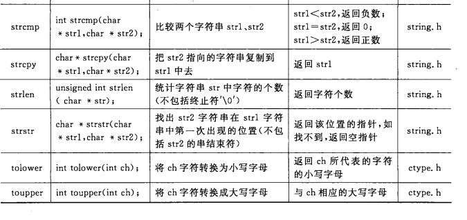
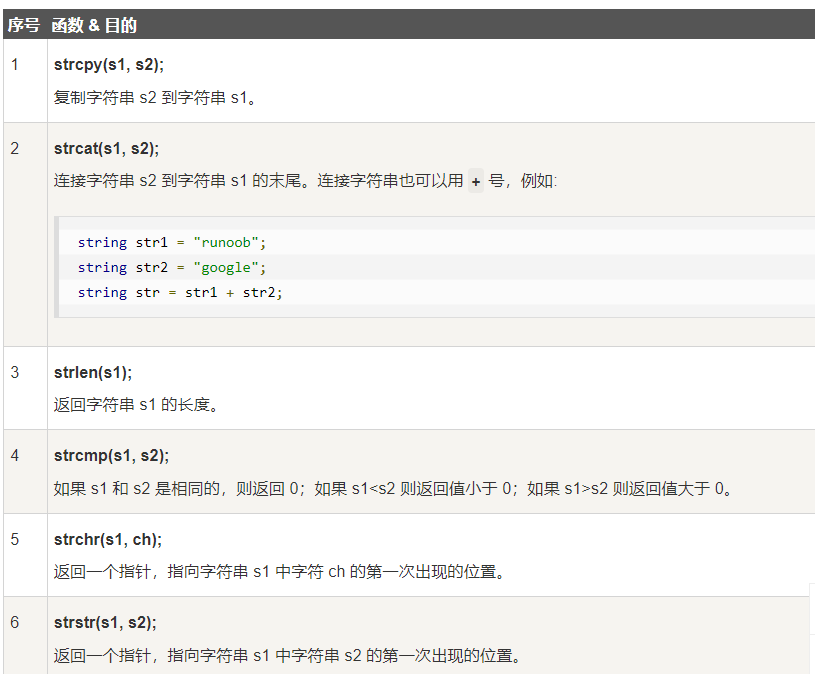

# 实验三

Owner: xqer

### 任务一：创建并运行内核线程

```

#include <linux/kthread.h>
#include <linux/module.h>
#include <linux/delay.h>

MODULE_LICENSE("GPL");
static char* id = "Student id";
module_param(id, charp, 0644);
MODULE_PARM_DESC(id, "char* param\n");
#define BUF_SIZE 20

static struct task_struct *stuIdThread = NULL;

static int print(void *data)
{
  char *id=(char *)data;
    int cnt=0;
  while(!kthread_should_stop()){
      if(*id!='\0')
      {
          printk("Index %d of student ID : %d.\n",cnt,*id-'0');
          cnt++;
          id++;
           msleep(3000);
      }
      else {
            printk("All digits of student ID have been printed.\n");
             msleep(5000);
      }

  }
  return 0;
}

static int __init kthread_init(void)
{
  printk("Create kthread stuIdThread.\n");
  stuIdThread = kthread_run(print, id, "stuIdThread");
  return 0;
}

static void __exit kthread_exit(void)
{
  printk("Kill kthread stuIdThread.\n");
  if(stuIdThread)
    kthread_stop(stuIdThread);
}

module_init(kthread_init);
module_exit(kthread_exit);

```

```
ifneq ($(KERNELRELEASE),)
  obj-m := kthread_stu_id.o
else
  KERNELDIR ?=/usr/lib/modules/$(shell uname -r)/build
  PWD := $(shell pwd)
default:
  $(MAKE) -C $(KERNELDIR) M=$(PWD) modules
endif
.PHONY:clean
install:
  insmod kthread_stu_id.ko id="2292020"
uninstall:
  rmmod kthread_stu_id
clean:
  -rm *.mod.c *.o *.order *.symvers *.ko

```


将参数指针传递给函数，然后在函数体内

`kthread_create()`、`wake_up_process()` 和 `kthread_run()` 都是 Linux 内核中用于创建和管理内核线程的函数。

`kthread_create()` 函数用于创建一个内核线程，它需要提供一个线程函数和一个传递给线程函数的参数，它返回线程结构体指针。需要注意的是，必须手动使用 `wake_up_process()` 函数启动内核线程，否则它将保持挂起状态。

`wake_up_process()` 函数用于唤醒一个挂起的内核线程。唤醒后，内核线程将被调度并开始执行。需要注意的是，唤醒的线程必须事先在 `kthread_create()` 函数中创建。

`kthread_run()` 函数是一个结合了 `kthread_create()` 和 `wake_up_process()` 的函数，它可以同时创建并启动一个内核线程，因此称为“快捷方式”。

总的来说，`kthread_create()`、`wake_up_process()` 和 `kthread_run()` 都是用于内核线程的管理工具，其中 `kthread_create()` 用于创建线程，`wake_up_process()` 则用于启动线程，而 `kthread_run()` 可以同时完成创建和启动的过程。通过这些函数，我们可以在 Linux 内核中灵活地创建和管理内核线程，从而实现各种复杂的操作和功能，例如并发控制、设备驱动、网络处理等。

### 任务二：绑定内核线程到指定CPU

**你知道MyPrintk中current全局变量的含义吗？**

current代表当前进程，定义在

include\asm-generic\current.h


[linux 内核 current全局变量_JDSH0224的博客-CSDN博客](https://blog.csdn.net/chenliang0224/article/details/80741259)

**请你编写kthread_bind_test.c，通过实验判断将线程绑定到指定CPU核心时，线程应当处于什么状态？唤醒线程后能否通过kthread_bind()切换线程所在CPU？**

修改代码为：

```
 bind_kthread = kthread_create(MyPrintk, NULL, "bind_kthread");
    kthread_bind(bind_kthread,0);
    wake_up_process(bind_kthread);
    kthread_bind(bind_kthread,1);
    printk("kthread bind_kthread start\n");
```


唤醒线程后再切换线程所在cpu，已经无法实现了


但是再唤醒线程前不绑定线程，可以切换线程

因此需要在线程未绑定时绑定线程。

**通过命令查看当前机器的CPU核数，若在绑定时设定的CPU核心ID超过机器本身的CPU核数，会产生什么结果？请结合实验结果验证你的结论。**

cat proc/cpuinfo



当前有两个cpu 每个有两个核心


发现当cpuid超过机器的cpu数时， 会选择0号cpu（尝试了cpuid为2，3，4，5）

**假设当前服务器CPU的核数为N，请你编写kthread_bind_cores.c，实现创建N个线程，每个线程与一个CPU核心绑定，并在各个线程运行时每隔2秒打印一次当前线程名和占用的CPU ID，要求每个线程使用同一个MyPrintk()打印函数。**

```
  bind_kthread0 = kthread_create(MyPrintk, NULL, "bind_kthread");
    bind_kthread1 = kthread_create(MyPrintk, NULL, "bind_kthread");
    kthread_bind(bind_kthread0, 0);
    wake_up_process(bind_kthread0);
    kthread_bind(bind_kthread1, 1);
    wake_up_process(bind_kthread1);
    printk("kthread bind_kthread start\n");
```


# 任务三


- ***阅读程序打印日志，内核初始化模块中，schedule_timeout_uninterruptible ()方法将哪个线程（给出线程名称comm）进入了睡眠状态？**

可以看到insmod线程进入了睡眠状态（state为2）

0代表运行状态，1代表等待，2代表睡眠，4代表终止，8代表被跟踪，具体见下面文件


在执行线程睡眠方法前后，线程的状态和 PID 可能会发生变化，具体取决于线程睡眠方法中等待的条件是否满足。如果条件满足，线程会从睡眠状态调度回来，状态变为运行中，PID 不变，可以继续执行。如果等待条件不满足，线程就会一直保持睡眠状态，直到等待条件被满足或者其他进程调用唤醒函数将其状态改为运行中。

内核模块卸载前后，线程的状态和 PID 可能也会发生变化，具体取决于线程所属的进程和内核模块的卸载时机。如果线程所属的进程在模块卸载前已经结束，线程的状态会变为 TASK_DEAD，PID 也会变化。如果线程所属的进程在模块卸载时仍然存在，线程的状态可能会由于模块卸载导致异常，例如出现空指针引用等问题



进程转换图：


# 任务四

模仿proc_cpu.c，将/proc/meminfo的内容也读取到变量中，然后输出

```
// 任务四、请你阅读proc_cpu.c文件，学习文件的读取和写入操作，编写proc_sys_info.c文件
//文件路径 /data/workspace/myshixun/exp1/task4/proc_sys_info.c
#include <linux/module.h>
#include <linux/init.h>
#include <linux/kernel.h>
#include <linux/fs.h>
#include <linux/sched/signal.h>
#include <linux/string.h>
#include <linux/sched.h>
#include <linux/kthread.h>

static struct task_struct *cycleprint_kthread = NULL;
char current_uptime[8] = "";
char total_memory[20] = "";
char free_memory[20] = "";

static int write_file(void) {
    char buf[20] = "";
    struct file *fp;
    loff_t pos;
    fp = filp_open("/home/kernel_file", O_RDWR | O_CREAT, 0644);
    if (IS_ERR(fp)) {
        printk("create file error\n");
        return -1;
    }
    pos = 0;
    kernel_write(fp, current_uptime, strlen(current_uptime), &pos);
    pos = 0;
    kernel_read(fp, buf, strlen(current_uptime), &pos);
    // printk("%s\n", buf);

    kernel_write(fp, total_memory, strlen(total_memory), &pos);
    pos = 0;
    kernel_read(fp, buf, strlen(total_memory), &pos);
    // printk("%s\n", buf);

    kernel_write(fp, free_memory, strlen(free_memory), &pos);
    pos = 0;
    kernel_read(fp, buf, strlen(free_memory), &pos);
    // printk("%s\n", buf);
    filp_close(fp, NULL);
    return 0;
}

static void sleep_milli_sec(int n_milli_sec) {
    long timeout = (n_milli_sec) * HZ / 1000;
    do {
        while (timeout > 0) {
            timeout = schedule_timeout(timeout);
        }
    } while (0);
}

static int load_time_info(void) {
    struct file *fp_time;
    loff_t pos;
    char buf_time[10];
    fp_time = filp_open("/proc/uptime", O_RDONLY, 0);
    if (IS_ERR(fp_time)) {
        printk("open proc uptime error\n");
        return -1;
    }
    pos = 0;
    kernel_read(fp_time, buf_time, sizeof(buf_time), &pos);
    strncpy(current_uptime, buf_time, 7);
    filp_close(fp_time, NULL);
    return 0;
}

static int load_mem_info(void) {
    struct file *fp_mem;
    loff_t pos;
    char buf_mem[100];
    char *tmp, *tmp2;
    fp_mem = filp_open("/proc/meminfo", O_RDONLY, 0);
    if (IS_ERR(fp_mem)) {
        printk("open proc file error\n");
        return -1;
    }
    pos = 0;
    kernel_read(fp_mem, buf_mem, sizeof(buf_mem), &pos);

    tmp = strstr(buf_mem, "MemTotal:");
    tmp2 = strstr(tmp, " kB\n");
    strncpy(total_memory, tmp + 10, tmp2 - tmp - 10);

    tmp = strstr(buf_mem, "MemFree:");
    tmp2 = strstr(tmp, " kB\n");
    strncpy(free_memory, tmp + 9, tmp2 - tmp - 9);

    filp_close(fp_mem, NULL);
    return 0;
}

static int print_fun(void *data) {
  //write to file
    write_file();
  //load proc file and print cpu_load info every 3 seconds
    while (!kthread_should_stop()) {
        if (load_time_info() != 0) {
            printk("error occurs when loading time info!\n");
            return -1;
        }
        if (load_mem_info() != 0) {
            printk("error occurs when loading memory info!\n");
            return -1;
        }
        printk("current uptime: %s s\n", current_uptime);
        int total_mem, free_mem, occupy_mem;
        sscanf(total_memory, "%d", &total_mem);
        total_mem/=1024;
        sscanf(free_memory, "%d", &free_mem);
        free_mem/=1204;
        occupy_mem = total_mem - free_mem;

        printk("total memory: %d MB\n", total_mem);
        printk("free memory: %d MB\n", free_mem);
        printk("occupy memory: %d MB\n", occupy_mem);
        sleep_milli_sec(3000);
    }
    return 0;
}

static int __init proc_parser_init(void) {
    cycleprint_kthread = kthread_run(print_fun, NULL, "cycle_print_kthread");
  printk("cycle_print_kthread started\n");
    return 0;
}

static void __exit proc_parser_exit(void) {
    if (cycleprint_kthread) {
        kthread_stop(cycleprint_kthread);
    }
    printk("cycle_print_kthread stopped\n");
}

module_init(proc_parser_init);
module_exit(proc_parser_exit);
MODULE_LICENSE("GPL");
```

结果


# 任务五

复现过程：


设置cpu核数


编写运行while_long.c


通过taskset命令可以看出while_long的处理器亲和性掩码是1，即二进制1，表示本机一共有1个CPU核心，该进程可以在任何一个CPU核心上运行

Cgroup 是 Linux 内核为了管理进程而开发的一种机制，它可以将一组进程（或者任务）放到一个受限的容器中，从而限制它们的资源使用（包括 CPU、内存、磁盘 I/O 等）。其中，对 CPU 资源的管理是通过对进程的 CPU 时间片（CPU 时间的分配单位）进行分配和控制实现的。

在 Cgroup 中，可以通过配置 CPU 限制参数，比如 `cpu.shares`，`cpu.cfs_period_us` 和 `cpu.cfs_quota_us` 等，来控制进程的 CPU 使用情况。其中，`cpu.shares`指定各个进程的相对权重，越大则优先级越高，占用 CPU 时间越多；`cpu.cfs_period_us` 指定周期时间，单位为微秒，每一个周期时间为一个时间量单位（Time quantum），因为 Linux 中基于时间片轮转算法的调度器为了避免频繁地进行上下文切换，会将时间片分成一定数量的小时间段（即时间量单位）进行调度，因此周期时间越小，时间量单位就越多；`cpu.cfs_quota_us` 则指定一个进程能够使用 CPU 时间片的总量，单位为微秒，如果进程使用的时间片超过了这个总量，则会被 Cgroup 系统强制暂停，直到下一个时间周期开始。

通过这些参数，我们可以对进程的 CPU 利用率进行精细的控制。比如，我们可以将一组进程放入同一个 Cgroup 中，并赋予它们相同的 `cpu.shares` 值，表示它们拥有相同的 CPU 权重；然后可以设置 `cpu.cfs_period_us` 和 `cpu.cfs_quota_us` 值，来限制进程的 CPU 时间片数量和使用时间总量。这样，我们就可以控制进程能够使用的 CPU 核数了。

总的来说，Cgroup 是 Linux 内核提供的一种资源管理机制，它可以将进程放入受限的容器中，从而限制它们对系统资源的使用。针对 CPU 资源，Cgroup 可以通过控制 CPU 时间片的分配和使用来限制进程的 CPU 利用率，从而实现对 CPU 核数的限制。

# 任务六

给出你对cgroup限制CPU利用率的过程总结，以及对cpu.cfs_quota_us 和 cpu.cfs_period_us 两个参数的理解。

Cgroup（Control Group）是Linux内核中用于限制和管理进程、线程和相关资源使用的一种内核机制。使用Cgroup可以对进程分配一定的资源，从而控制其使用量，这里主要介绍Cgroup限制CPU利用率的过程。 在Cgroup中，可以使用CPU控制参数来限制CPU使用量，其中两个主要参数是cpu.cfs_period_us 和 cpu.cfs_quota_us，这两个参数可以用于限制进程的CPU利用率。 cpu.cfsperiodus：一个周期的时间，单位是微秒。表示一个时间轮转周期的长度。这里所说的时间轮转是指Linux中的调度算法，对于每个Cgroup中的任务，将其任务量按照权重分配到周期时间长度中的时间片中； cpu.cfsquotaus：一个时间段内可用的CPU时间量的限制，单位是微秒。表示在一个时间轮转周期时间内，进程可以使用的CPU时间总量上限。 具体的操作步骤如下： 对Cgroup中的进程进行权值的分配： echo weight &gt; /sys/fs/cgroup/cpu/groupname/cpu.weight

对Cgroup中的进程限制可用的CPU时间总量： echo cpu.cfs_quota_us &gt; /sys/fs/cgroup/cpu/groupname/cpu.cfs_quota_us 设置Cgroup中的进程在时间周期内的长度： echo cpu.cfs_period_us &gt; /sys/fs/cgroup/cpu/groupname/cpu.cfs_period_us 在以上设置完成后，Cgroup就会根据weight和cpu.cfs_quota_us两个参数的权值来限制进程使用的CPU总量。

# 实验总结

在该实验中我了解了线程的创建，状态转换，cpu绑定，通过/proc文件系统获取系统当前运行状态；以及了解了cgroup进程分组化管理工具，学习如何限制内核线程的CPU核心数和利用率。