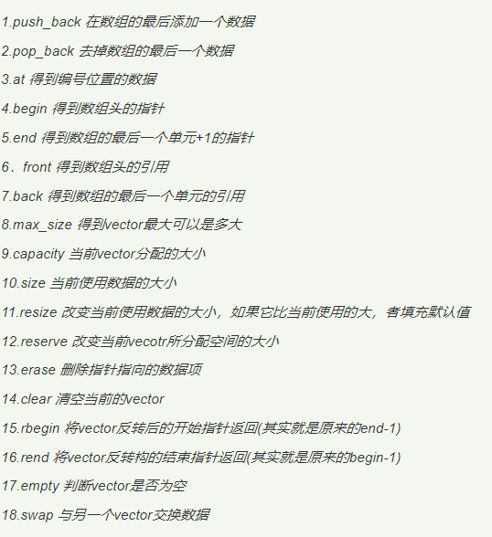
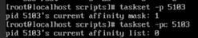

# 指令系统

Owner: xqer

# 基本概念

如今CPU指令集分为ＣＩＳＣ（复杂指令系统计算机）和ＲＩＳＣ（精简指令系统计算机）

任何一个指令系统要满足：完备性（任何可解问题都可以用指令实现。一个完备的指令系统应包括数据传送和交换指令，算术及逻辑运算指令、 输入输出指令、 程序控制指令、 CPU控制指令）、有效性（高效率）、规整性（对称性、匀称性、指令格式和数据格式的一致性）、兼容性

一条基本的指令包括：

操作码　操作数地址　操作结果的存放地址　　下一条指令的地址（由程序计数器ＰＣ实现）

**概括为操作码字段　　地址码字段**

ＣＩＳＣ为变长指令字结构

ＲＩＳＣ为等长指令字结构

指令类型

括号为取地址符，取出地址为A1的数

三地址 （A1源操作数地址） op （A2操作数地址） →A3（存放结果的地址）

二地址又分为：

# 指令分类

# 指令集分类

## CISC

## RISC

# 操作码

## 定长编码

## 变长编码

Huffman编码可以使操作码平均长度最小， 但形成的操作码不规整， 不

利于译码。 一种实际可行的优化编码是Huffman扩展编码， 它是介于定长编

码和Huffman编码之间的编码方式。

# 寻址方式

## 指令寻址方式

### 顺序寻址

### 跳跃寻址

## 操作数寻址方式

### 隐含寻址

例如div al 被除数的地址隐含给出

### 立即寻址

指令中地址字段给出的是操作数本身

### 直接寻址

地址直接在地址字段给出

间接寻址

寄存器寻址

寄存器间接寻址

变址寻址

基址寻址

块寻址 在指令中指出数据块的起始地址和数据块长度

段寻址 段寄存器*16+某个寄存器的地址

相对寻址 PC寄存器的值加减某个值

# 堆栈

## 串联堆栈

## 存储器堆栈

# 问题

