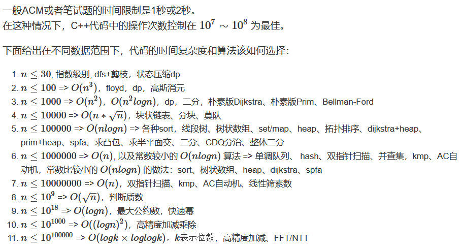

# ＣＰＵ

Owner: xqer

# CPU技术参数

1.字长

2.内部工作频率（内频）倒数是时钟周期，是CPU中最小的时间元素

3.外频 主板为CPU提供的基准时钟频率 内频=外频*倍频

4.片内cache容量和速度 容量一般为几百KB，速度与内频接近

5.地址总线宽度 CPU可以访问的最大物理地址空间

6.数据总线宽度 一次数据传输的信息量

7.制造工艺 单元门电路的宽度

# ＣＰＵ基本功能：

指令控制，操作控制，时间控制，数据加工

# ＣＰＵ基本组成

## 控制器：

程序计数器（ＰＣ）、 指令寄存器（IR）、 指令译码器、 时序产生器和操作控制器

### 功能：

从内存取指令，指出下一条指令的位置

对指令进行译码或测试，产生相应的操作控制信号

指挥并控制CPU，内存和输入、输出设备之间数据流方向

## 运算器：

算术逻辑单元 (ALU)、 累加寄存器（ＡＣ）、 数据缓冲寄存器（DR）和程序状态寄存器（ＰＳＷ）

### 功能：

执行所有的算术运算和逻辑运算（包括逻辑测试）

## cpu的主要寄存器

数据缓冲寄存器（DR）

暂时存放 从内存读出 或 将要写入内存的 指令或数据字

指令寄存器（IR）

保存正在执行的指令

程序技术器（PC）

确定下一条指令的地址

地址寄存器（ＡＲ）

保存当前CPU所访问的内存单元地址

累加寄存器（AC）

为ALU提供工作区，暂时存放ALU的结果信息

程序状态寄存器（PSW)

保存由算数指令和逻辑指令运行或测试的结果的条件码，如进位标志，溢出标志，零标志，负标志

## 操作控制器

根据指令操作码和时序信号，产生操作控制信号

时序逻辑型

存储逻辑型

二者结合型

# 指令执行

指令周期：取出并完成一个指令的时间

CPU周期（机器周期）:访问一次主存的时间（也叫总线周期）

一个指令周期至少需要取指周期和执行周期

时钟周期：节拍脉冲或T周期

CLR指令

取指令阶段：

PC寄存器内容装入AR，PC+=1，AR放入地址总线，对应地址的指令经数据总线传到数据缓冲寄存器DR，DR内容送到IR（指令寄存器），IR中操作码被译码或测试

ADD指令

执行指令：

指令寄存器的地址码装入AR

AR发送到地址总线，去除内容到DR，将DR和AC送往ALU相加，结果存入AC

## 方框图

一个方框代表一个CPU周期，菱形框表示判别或测试，时间上依附于前一个方框的CPU周期

# 时序信号产生

# 控制方式

同步控制方式

# 微程序控制器

微程序控制：

把操作控制信号编成微指令，放到只读的控制存储器中，运行时一条条读出微指令

**控制部件**向执行部件发出的各种控制命令， 称为微命令。 **执行部件接受微命令后所进行的操作**， 称为微操作。

一条机器指令可以分解为一个微操作序列

一组微命令组合叫微指令

微指令组合叫微程序

## 微程序控制器组成

### 1.控制存储器

用来存放实现全部指令系统的微程序

读出并执行微指令的时间为微指令周期

### 2.微指令寄存器

用来存放由控制存储器读出的一条微指令信息

其中微地址寄存器决定将要访问的下一条微指令的地址， 而微命令寄存器则保存一条微指令的操作控制字段和判别测试字段的信息

### 3.地址转移逻辑

如果微程序不出现分支， 那么下一条微指令的地址就直接由微地址寄存器给出。 当微程序出现分支时， 意味着微程序出现条件转移。 在这种情况下， 通过判别测试字段P和执行部件的“状态条件” 反馈信息， 去修改微地址寄存器

的内容， 并按改好的内容去读下一条微指令。 地址转移逻辑就承担自动完成修改微地址的任务。

微命令编码

直接表示

编码表示

把一组相斥性的微命令信号组成一个小组(即一个字段) ， 然后通过小组(字段)译码器对每一个微命令信号进行译码

每个小组还要留出一个状态， 表示小组不发出任何微命令。

混合表示

微地址转移逻辑

1.计数器方式

微命令