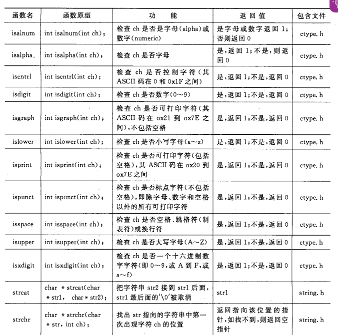

# lab4

Owner: xqer

reliability and congestion control protocol design

# 理论知识

## 可靠信道传输原理：

1.对于出错情况，设置bit校验（UDP就能做）

2.为保证数据不出错，引入接收方反馈与重传机制

发送方有发送和等待确认两个状态

接收方只有一个状态，只需要校验数据，发送ACK或NCK

停等协议

3.必须考虑ACK和NCK受损情况，此时选择若收到受损的ACK或NCK直接重传。但是又引入了冗余分组情况，接收端不知道是重传的还是下一个包。再引入序号机制。接收方检查序号判断是否是重传。

（若接受出错时，接收端不发送NCK，而是发送已经接收到的包的ACK，发送端接收到冗余ACK，也会重传，这样删掉了NCK）

4.考虑丢包问题，引入一个定时器，发送一个包，开启定时器，一段时间后没有收到ACK，则认为丢包，进行重传

至此，可靠信道传输建立。

## 流水线可靠数据传输

一次发送多个包

5.GBN

第一个未被确认的包有一个定时器，该定时器超时会发送之后所有的包

6.SR 选择重传

每个包都有定时器

发送方

## TCP使用的流水线

只为最小未被确认的包设置定时器（因为定时器开销太大了），同时使用累计确认，如何在sendbase之后的包y收到了，则认为y之前的都被确认了，sendbase设置为y+1

而接受方当不失序的时候，发送最后收到的包的ACK

失序时，先把失序的包缓存，不发送失序的包的ACK，而是最小的未收到的包的ACK（冗余ACK）。这样达到了累计确认的目的

可以说TCP是SR和GBN的结合

## 快速重传

当收到冗余ACK时，就开始重传，而不是等计时器结束

## 流量控制

接收端计算其接受窗口rwnd的大小

rwnd=RcvBuffer-【lastByteRcvd-LastByteRead】

将其添加到报文段返回，发送端确保已经发送未被确认的数据小于rwnd

### 阻塞控制

设置一个阻塞窗口，每次根据收到ACK或者定时器超时或者冗余ACK来设置窗口大学，未确认的数据也不能超过阻塞窗口的大小

# fishnet 实现

## 机理

tranfer执行流程

创建一个node tcpman tcpsock

绑定本地端口

连接目的端口 tcpsock.connect （实际是又创建一个TCPSockclient进行三次握手）

TranferClient通过该tcpsock，进行 传输

TranferClient工作

server流程

创建一个node tcpman tcpsock

绑定本地端口

监听本地backlog tcpsock.listen （实际是又创建一个TCPSockServer进行服务）

Tranferserver通过该tcpsock，负责接受

## OUTPUTS

在emulate模式运行，开启两个节点

节点1作为服务端

监听21端口，最多允许两个连接

节点0作为客户端，进行传输

对于发送端

S代表发送了SYN

.代表正常发送packet

：代表收到ACK

？代表收到了序号小于最小的未确认报文的ACK

！代表要发送的packet不是nextseqnum（已发送的最大的序号），即进行了重传

F:发送了FIN

对于接收端

S代表发送了SYN

.：代表正常收到按序的packet

:?代表收到失序的packet

!？代表收到了已经确认的报文，忽略

F:发送了FIN

上图中第一次发送端显示！，代表着超时未收到ACK，所以重传，之后收到了对重传的ACK，所以显示？

接收端在此时收到！？,代表重传的分组已经收到过。

所以这次异常应该是接收端发送的ACK丢包导致的。

同理可推测出其他地方的异常原因以及该协议如何解决的。

# Discussion Questions

1.随机值好些，可以避免某些安全性攻击

设成固定的值的话，可能会有攻击者在没收到SYN数据包请求时，伪造假的数据包发送给客户端，随机值可以避免这一情况

2.如何收到SYN攻击，由于设置了backlog的值，只有在待处理的请求池没满时才会接受SYN，满了时就不会接受。避免了无限浪费服务器的资源。

我在服务端开始监听时就创建一个队列存储可以支持的最大连接数目的TCPsocket，接收到SYN时，队列没满，就创建个socket加入到队列中。队列满时就丢弃该请求。