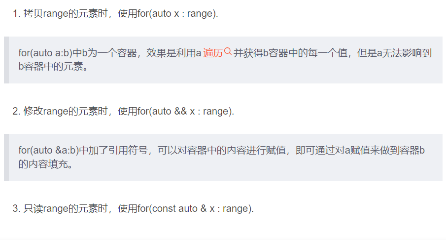
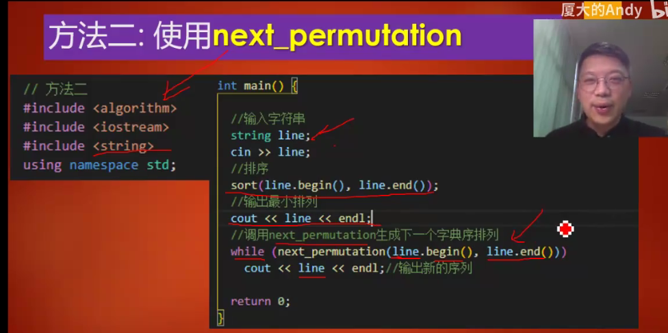

# 运输层

Owner: xqer

[lab4](lab4%20be5afb2c2a49461cbc3a49165f35def4.md)

# 概述

运输层基本功能：将网络层的在两个**端系统之间**的交付服务拓展到运行在两个**不同端系统上的应用层进程**之间的交付服务（多路复用与多路分解）

运输层服务：可靠通信 、拥塞控制、差错检查

应用层 —message—》运输层 —segment—》网络层—datagram

运输层功能由UDP（无连接、不可靠）和TCP（可靠、面向连接）两种协议实现

UDP：仅有进程数据交付和差错检查两种服务

TCP：UDP+可靠通信（确保正确地 、按序地将数据从发送进程交付给接收进程） 、拥塞控制（力求为每个通过一条拥塞网络链路的连接平等地共享网络链路带宽）、流量控制

传输层办不到的：延迟保证、带宽保证

# 多路复用与多路分解

多路分解:将运输层报文段的数据交付到正确的socket

多路复用：从不同的socket收集数据块，封装上首部信息生成报文段，传递到网络层

实现方式：

1.socket有唯一标识符

2.报文段有特殊字段指示要交付到的套接字（就是端口号）

0~1023为周知端口号，一般有固定用途

## 无连接多路分解：

接收端接收时只考虑目的IP和目的端口

两个相同的目的IP和端口的报文段会被定向到同一个socket

源端口号只在返回时用

## 面向连接多路分解

TCP套接字用四元组（源 IP 地址，源端口号，目的 IP 地址．目的端口号）来标识的

两个不同的源IP地址和源端口号的请求会定向到两个不同的套接字（除非报文里里有创建连接的请求）

# UDP实现原理

几乎是直接与IP打交道。

SNMP，DNS，多媒体应用

## 选择UDP原因：

1.没有阻塞控制，立刻将数据放入网络层。适合需要确保最小发送速率，容忍部分数据丢失的应用

2.无需建立连接，减少了建立连接时延

3.无连接状态，服务器可以支持更多用户

4.分组首部开销少

## 检验和

发送方将UDP报文段按16bit划分，加在一起（溢出要回卷）结果的反码就是检验和

接收方将所有16bit的字相加，得到全是1的序列，则没错误

# 可靠数据传输原理

### v1.假设底层信道可靠

### v2.自动重传协议

能实现接收方发现比特错误后要求重传

需要增加以下功能：差错检测、接收方反馈、重传

此时若未收到ACK信息，发送端会一直停等

如果ACK或NAK信息受损，发送方会重传，此时为了让接收方理解是重传还是新的分组，需要在分组前加一个序号

### v3.检测丢包及处理（比特交替协议）

选择一个时间值判断丢包，时间内没有收到就重传

- 每次发送 一个分组（包括第一次分组和重传分组）时，便启动 一个定时器。
- 响应定时器中断（采取适当 的动作）
- 终止定时器

### v4. 流水线可靠数据传输协议

定义发送方利用率$U_{sender} = \frac{L/R}{RTT + L/R}$Usender​=RTT+L/RL/R​

停等方式运行利用率很低，因此用流水线传输协议

差错恢复：回退N步和选择重传

回退N步：

选择重传：

发送方仅重传怀疑在接收方出错的分组

窗口长度必须小于或等于序号空间大小的一半 。

# TCP连接

面向连接的，点对点的

发送数据前要握手，以便连接双方初始化与TCP连接的相关的许多TCP状态变量

建立过程（三次握手）：

客户首先发送一个特殊的 TCP 报文段，服务器用另一个特殊的 TCP 报文段来响应，最后，客户再用第 三个特殊报文段作为 响应。前两个报文段不承载 “有效载荷＂，也就是不包含应用层数据；而第三个报文段可以承载有效载荷 。

发送方和接收方分别有发送缓存和接受缓存，在适当的时间从发送缓存中取出数据

*取出的数据数量受限于MSS（最大报文段长度），由链路层的最大帧长度MTU设置。*

累计确认模式

## 往返时间估计：

在任意时刻，仅为一个已发送的但目前尚未被确认的报文段估计 SampleRTT, 从而产生一个接近每个 RTI 的新 SampleRTT值 。

设置的超时值是估计的RTT加上波动余量

## 可靠数据传输

可靠数据传输服务确保一个进程从其接收缓存中读出的数据流是无损坏 、无间隙 、 非冗余和按序的数据流

实现方式：

超时机制

累计确认

冗余确认

一且收到 3 个冗余 ACK, TCP 就执行**快速重传**

超时间隔加倍

一次重传后，会将超时间隔加倍，直到收到ACK，恢复为原本的timeoutinterval

选择确认：

接收方有选择地确认失序报文段，因此TCP差错恢复是GBN和SR的混合体

## flow control

防止发送端发送速度过快，接收方缓冲区溢出

发送方保证

当B的rwnd为0时，发送方A继续发送只有一个字节数据的报文段，接收方确认后，将缓冲区清空，发送一个确认报文包含新的非0的rwnd值

## TCP连接管理

# 阻塞控制