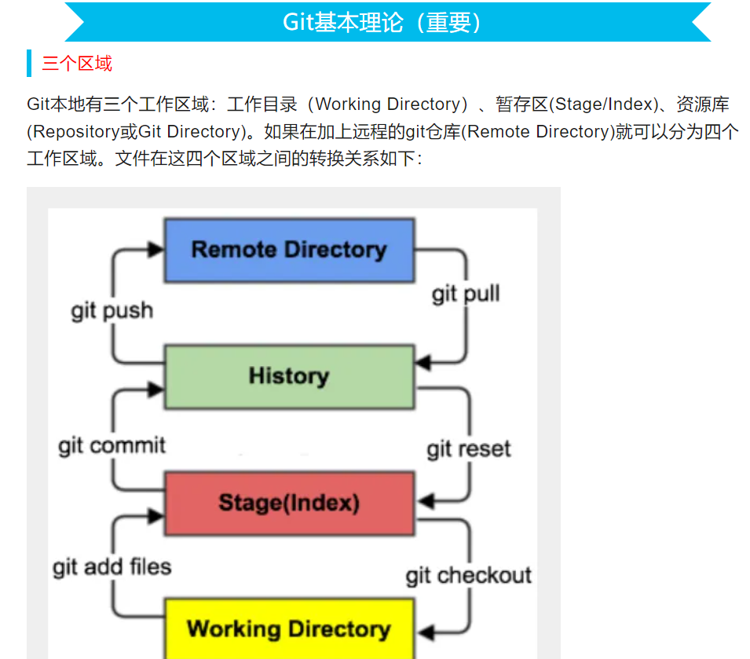
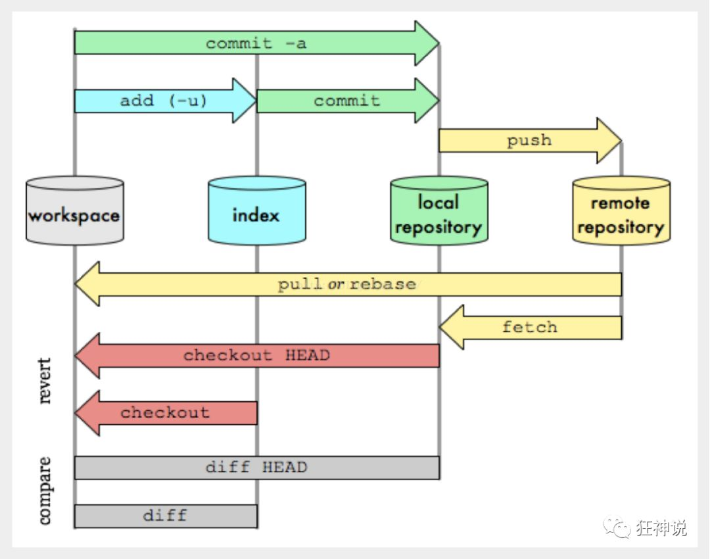

# git与github

Owner: xqer

git 教程

原理：git将文件空间分为工作区，暂存区，版本库

工作区就是你本地正在处理的文本

处理好之后，add到暂存区

没有问题后，再commit到版本库



注意：git只能跟踪纯文本文件，也不要用windows的记事本编辑文件 vscode>记事本

使用流程

本地git仓库

```
初始化：
git init

提交commit:
git add  file
git commit -m "commit explain"

 查看仓库状态:
git status

比较暂存区与工作区的差异
git diff ’files to be compared‘

比较两次commit之间差异
git diff 版本指针1 版本指针2  （要比较的文件）

查看commit状态
git log
        --pretty=oneline 一行输出

版本回退：
git reset --hard  版本指针
      版本指针：
          1.HEAD 当前版本 HEAD~ 上一个 HEAD~100 往上100个
          2.版本号（前几位即可)

查看commit历史
git reflog

扔掉工作区的修改（把文件恢复到上一次add或者commit的状态）
git checkout -- readme.txt
git checkout   

git checkout HEAD~1

  - 作用：切换到上一个commit，创建一个"detached HEAD"状态
  - 效果：
    - 工作目录变成上一个commit的状态
    - 处于detached HEAD模式（不在任何分支上）
    - 之前的所有更改都还在，但在当前分支上看不到
    - 可以通过 git checkout main 回到原分支，所有更改会重新出现

git reset --hard HEAD~1

  - 作用：将当前分支重置到上一个commit
  - 效果：
    - 完全删除最新的commit和所有未提交的更改
    - 工作目录和暂存区都变成上一个commit的状态
    - 所有更改都丢失了
    - 分支历史被重写

  - 如果想临时查看历史状态：用 git checkout HEAD~1
  - 如果想永久删除最新更改：用 git reset --hard HEAD~1
  
  
git remove -df
删除版本库的文件:
git rm test.txt
git commit -m "remove test.txt"0

一次添加所有改变的文件
git add -A .
一次添加所有文件
git add -A
添加新文件和编辑过的文件不包括删除的文件
git add .
表示添加编辑或者删除的文件，不包括新添加的文件
git add -u

查看配置 
git config -l

#查看系统config
git config --system --list
　　
#查看当前用户（global）配置
git config --global  --list
```

远程仓库

10.24.94.10

```
先把本机的sshrsa公钥上传到github账号

关联远程库：
git remote add origin git@github.com:michaelliao/learngit.git
//把远程库设置名称为origin

本地内容推送到远程库
git push -u origin master  //远程库名  远程分支名 （若远程分支不存在，该命令可以创建远程分支

提交修改
git push origin master

查看远程库信息：
git remote -v

删除远程库：
git remote rm origin

从远程库克隆：
git clone git@github.com:michaelliao/gitskills.git

下载远程库中更改的地方到本地
git fetch

git pull = git fetch + git merge
```



分支管理：

```
创建分支：
git branch dev

切换到分支:
git checkout dev
或
git switch master

创建并切换分支：
git checkout -b dev
或
git switch -c dev

查看当前分支：
git branch

删除分支:
git branch -d dev

合并分支到master：
git merge dev
    冲突后会把冲突信息写进文件里，status查看原因 解决后再merge

查看分支合并情况：
git log --graph --pretty=oneline --abbrev-commit

创建分支的时候就同步远程分支 !! 注意，创建分支的
git checkout -b async origin/async

git merge --no-ff -m "merge with no-ff" dev
   在merge时是Fast forward模式下会创建新的commit状态，保留分支信息
   
   
git branch -v 查看本地分支
git branch -r 查看远程分支 
  origin/HEAD -> origin/main
  origin/main
  origin/master  
  含义是默认分支是main
  
git branch -vv
查看本地和远程分支的绑定关系 
  main   657728f [origin/main] CREATE docker-ubuntu-22.4 
  绑定后能看到和远程的跟踪关系
```

bug分支 和Feature 未完待续。。。

[Bug分支](https://www.liaoxuefeng.com/wiki/896043488029600/900388704535136)

使用中的一些细节问题

有些文件被忽略

.gitignore


[git强制添加所有文件_TurboMT的博客-CSDN博客_git 强制添加](https://blog.csdn.net/qq_15957557/article/details/107842523)

每次提交，git把它们穿成一条时间线，每个时间线为一个分支，初始时只有一条时间线即为主分支，又叫master分支。HEAD严格来说不是指向提交，而是指向master。

当我们创建新的分支，例如dev时，git新建一个指针叫dev，指向master相同的提交


# github 使用

https://juejin.cn/post/7260690057660563517

action与workflow

[https://www.datadoghq.com/dg/software-delivery/github-actions-ci/?utm_source=google&utm_medium=paid-search&utm_campaign=dg-synthetics-apac-githubactions-ci&utm_keyword=github actions workflow&utm_matchtype=p&igaag=151198440223&igaat=&igacm=15419168580&igacr=688555130310&igakw=github actions workflow&igamt=p&igant=g&utm_campaignid=15419168580&utm_adgroupid=151198440223&gad_source=1&gclid=Cj0KCQjwn9y1BhC2ARIsAG5IY-6U5TAgz-E0g-Q2lf8Mf5TKC-mcggH6-dfbNInN8zCjonHWiuwC4gIaAkGQEALw_wcB](https://www.datadoghq.com/dg/software-delivery/github-actions-ci/?utm_source=google&utm_medium=paid-search&utm_campaign=dg-synthetics-apac-githubactions-ci&utm_keyword=github%20actions%20workflow&utm_matchtype=p&igaag=151198440223&igaat=&igacm=15419168580&igacr=688555130310&igakw=github%20actions%20workflow&igamt=p&igant=g&utm_campaignid=15419168580&utm_adgroupid=151198440223&gad_source=1&gclid=Cj0KCQjwn9y1BhC2ARIsAG5IY-6U5TAgz-E0g-Q2lf8Mf5TKC-mcggH6-dfbNInN8zCjonHWiuwC4gIaAkGQEALw_wcB)

datalog 监控action

```python

```