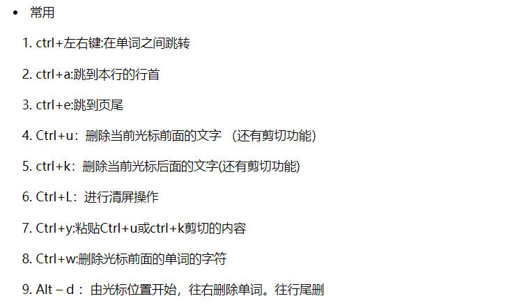

# linux

Owner: xqer

# 基础知识

什么是linux linux是纯开源，可以被随意使用的吗，linux在什么场景下使用，linux和debian，freebsd的关系和区别，linux和Unix，macos的区别

linux操作系统的理念是什么

细节：

什么是环境变量？

shell是什么？

进程和线程

linux如何进行内存管理的

linux如何进行网络管理的

# 常用快捷键

https://www.cnblogs.com/aslongas/p/5899586.html



# Shell

## 什么是shell

Shell 是一个用 C 语言编写的程序，它是用户使用 Linux 的桥梁。Shell 既是一种命令语言，又是一种程序设计语言。
Shell 是指一种应用程序，这个应用程序提供了一个界面，用户通过这个界面访问操作系统内核的服务。Ken Thompson 的 sh 是第一种 Unix Shell，Windows 文件管理器是一个典型的图形界面 Shell。

Shell 脚本（shell script），是一种为 shell 编写的脚本程序。
业界所说的 shell 通常都是指 shell 脚本，但读者朋友要知道，shell 和 shell script 是两个不同的概念。

## 常用的shell

Linux 的 Shell 种类众多，常见的有：

- Bourne Shell（/usr/bin/sh或/bin/sh） **是UNIX最初使用的shell，而且在每种UNIX上都可以使用。Bourne Shell在shell编程方便相当优秀，但在处理与用户的交互方便作得不如其他几种shell。**
- Bourne Again Shell（/bin/bash）
• linux默认，与Bourne Shell完全兼容，并且在Bourne Shell的基础上增加了很多特性。可以提供命令补全，命令编辑和命令历史等功能。它还包含了很多C Shell和Korn Shell中的优点，有灵活和强大的编辑接口，同时又很友好的用户界面。
- C Shell（/usr/bin/csh）是一种比Bourne Shell更适合的变种Shell，它的语法与C语言很相似
- K Shell（/usr/bin/ksh）
- Shell for Root（/sbin/sh）
- ……macos使用的zsh

本教程关注的是 Bash，也就是 Bourne Again Shell，由于易用和免费，Bash 在日常工作中被广泛使用。同时，Bash 也是大多数Linux 系统默认的 Shell。

通过在sh脚本第一行用 #!/bin/bash 来确定要使用的bash

不同的shell的内置命令和外部命令种类是不同的

# 常用命令

什么是shell

命令分为什么？

UNIX 命令有内部命令和外部命令之分。内部命令实际上是shell程序的一部分，其中包含的是一些比较简练的UNIX系统命令，这些命令由shell程序识别并在shell程序内部完成运行，通常在UNIX系统加载运行时shell就被加载并驻留在系统内存中。外部命令是UNIX系统中的实用程序部分，因为实用程序的功能通常都比较强大，所以它们包含的程序量也会很大，在系统加载时并不随系统一起被加载到内存中，而是在需要时才将其调进内存。通常外部命令的实体并不包含在shell中，但是其命令执行过程是由shell 程序控制的。shell程序管理外部命令执行的路径查找、加载存放，并控制命令的执行。内部命令要比外部命令的反应时间快一些，内部命令不用启动一个子shell来运行。

man命令是一个可以查询各个命令的使用手册的命令，用于查看各种命令、函数和配置文件的手册页面：

man用法：

```python
man <命令名> 例如 man ls
man [选项] [节号] 命令/主题
BIO_printf
一些常见的选项包括：
-f：显示与指定关键字相关的手册页面。
-k：搜索手册页中与关键字匹配的条目。
-a：显示所有匹配的手册页面。
-w：仅显示手册页的位置，而不显示其内容。
常见的节号包括：
1：用户命令
2：系统调用
3：C库函数
4：设备和特殊文件
5：文件格式和约定
6：游戏和演示
7：杂项
8：系统管理命令

csh(1) 就代表第一节里面的csh shell的介绍文档的位置

man不仅可以查命令，配置文件，概念什么的也可以查
使用说明
https://www.geeksforgeeks.org/linux-unix/man-command-in-linux-with-examples/

为什么man 一些命令的时候，返回的都是built-in页面？
因为history是shell的内置命令，不是独立的可执行文件,手册写多了冗余，macOS讲多个内置命令放到了
builtin（1）页面，

```

基本命令：

通过查阅man

[history ](linux/history%20290df113350c80a8aa5dd23ac8ea69a2.md)

[find](linux/find%204745783358814360bcb62e6c55e541c0.md)

[curl](linux/curl%20d463fe6bd8af49a89d01cc6a4116570d.md)

[gdb](linux/gdb%20346a8f6762b04294a8c3d56a9a345426.md)

[Grep、awk、sed](linux/Grep、awk、sed%20f08efa9ecc0a4c6e9972f25d5b8d05df.md)

[maven](linux/maven%20323edd1305ec47f589bbf2aa987c68aa.md)

[npm](linux/npm%20426bba3a2c5246628fda18e859d2cb4b.md)

[nvm](linux/nvm%20071f05bab477410fbe0566e987b86497.md)

[ssh](linux/ssh%20ab9cc7a672a944daa017a8719302fa62.md)

[vim](linux/vim%2014612fc33ba243c18f6b6100645064c5.md)

[命令大全](linux/命令大全%20307e78c4689843ea8acf4f08dcb1702c.md)

[安装软件](linux/安装软件%202b92471650084c8bb0f3a11f69400716.md)

[实战演练](linux/实战演练%20ac09f302a364441dbf6fbe209f52b6dc.md)

[开发环境搭建](linux/开发环境搭建%207a6c76c647f6479eb1994d6b260719a5.md)

[磁盘管理](linux/磁盘管理%20a6698a036cad46f58eb0c15faa1f5e04.md)

[shell脚本](linux/shell脚本%200b93461ec5d842d4a29d8fbe73951b7a.md)

[apt与snap](linux/apt与snap%2025adf113350c80eb8fb4fc9760d7553f.md)

[网络调试](linux/网络调试%2025adf113350c805f9093d64575a86ad1.md)