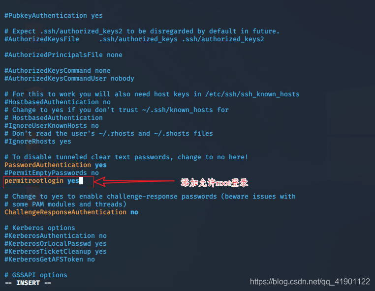
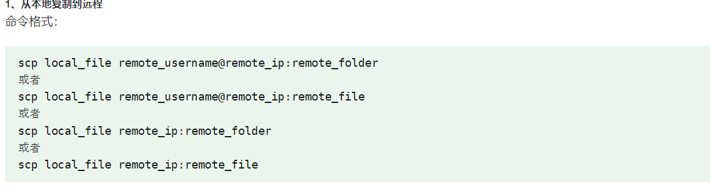

# ssh

Owner: xqer

# 开启ssh服务

vi /etc/ssh/sshd_config

/etc/init.d/ssh restart 重启 或者 service ssh start 重启 /etc/init.d/ssh status 状态是否正常运行 或者 service ssh status 状态是否正常运行

update-rc.d ssh enable 开机启动

scp

[https://www.runoob.com/linux/linux-comm-scp.html](https://www.runoob.com/linux/linux-comm-scp.html)

