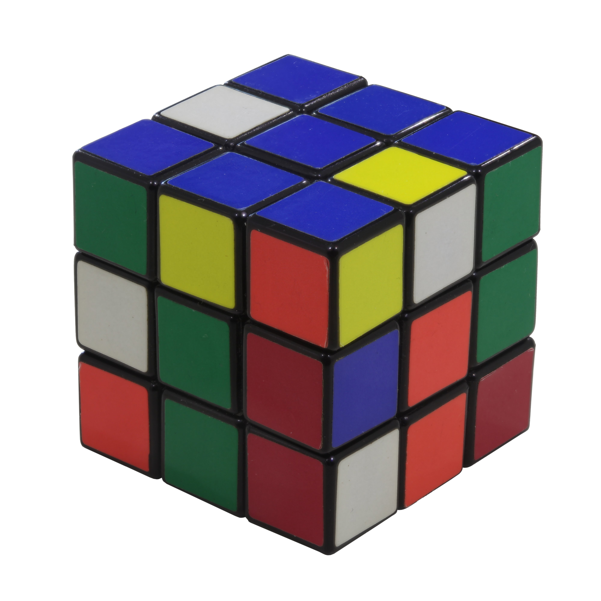
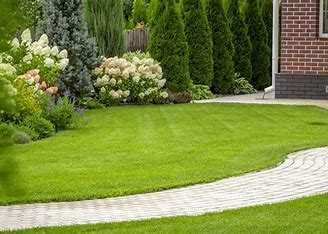
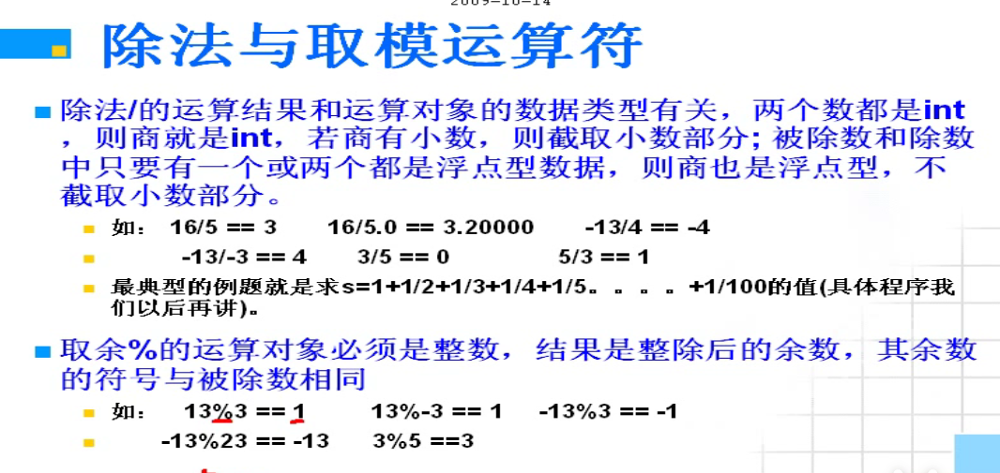
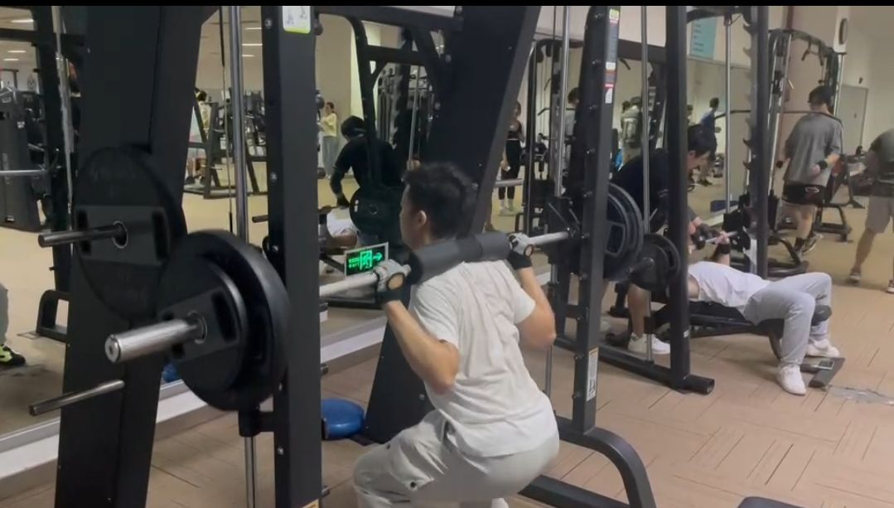

# 实验四五

Owner: xqer

# Demo4 LinearSVM

1.划分训练和测试数据；

2.提取数据特征；

用上一节的HOG方法提取特征，调库

```
extractHOGFeatures(img)
```

3.模式识别算法实战（LinearSVM）；

Linear SVM（支持向量机）是一种监督式机器学习算法，用于分类和回归分析。它的工作原理是找到将数据分为不同类别的最佳超平面。

超平面是将数据点分为两个类别的线或平面。线性SVM算法的目标是找到最大化两个类别之间距离的超平面。距离是超平面和每个类别中最近数据点之间的距离。

线性SVM算法被称为“线性”，因为它使用线性函数来定义超平面。超平面由以下方程定义：

w*x + b = 0

其中w是权向量，x是输入向量，b是偏差项。权向量w和偏差项b在训练过程中学习。

线性SVM算法在许多应用程序中被广泛使用，例如图像分类，文本分类和生物信息学。它是分类任务的流行选择，因为易于实现，高效并且可以处理大型数据集。

svm也可以用与多分类，原理如下

一对多(OvR)方法：将多分类问题转化为多个二分类问题，分别训练多个SVM模型，每个模型将一类作为正例，其他所有类别作为负例。然后通过将每个样本输入到所有SVM中并选择具有最高置信度的SVM来进行分类。相比于一对一OvO模型，OVR更简单并且计算成本更低。

4.自由实验：SVM模型测试及分析

```
allImages = imageDatastore('DataBase', 'IncludeSubfolders', true, 'LabelSource', 'foldernames');
[train_data, test_data] = splitEachLabel(allImages, 0.8, 'randomize');

train_features = zeros(size(train_data.Files, 1), 26244);
for i = 1:size(train_data.Files, 1)
    img = readimage(train_data, i);
    img = imresize(img, [227, 227]);
    feature = extractHOGFeatures(img);
    train_features(i,:) = feature;
end

% 提取测试集特征
test_features = zeros(size(test_data.Files, 1), 26244);
for i = 1:size(test_data.Files, 1)
    img = readimage(test_data, i);
    img = imresize(img, [227, 227]);
    feature = extractHOGFeatures(img);
    test_features(i,:) = feature;
end
% 训练线性SVM分类器
% svm_model = fitcsvm(train_features, train_data.Labels, 'KernelFunction', 'rbf','ClassNames',[ "Cap"
%      "Cube"
%      "OutDoorGreen"
%      "OutDoorRoad"
%      "Playing Cards"
%      "Screwdriver"
%      "Torch"], 'BoxConstraint', 1);
svmModel = fitcecoc(train_features, train_data.Labels);
% 测试模型
predicted_labels = predict(svmModel, test_features);

% 计算分类准确度
accuracy = sum(predicted_labels == test_data.Labels)/numel(test_data.Labels);
disp(['Classification accuracy: ' num2str(accuracy)]);

img = imread("66.jpg");

img = imresize(img, [227, 227]);
imshow(img)
feature = extractHOGFeatures(img);
predict(svmModel, feature)
```

利用fitcecoc函数训练OvRsvm模型，精确率达到了


选择几张图片测试








网上找了几张图片，都得到了正确的分类，模型的鲁棒性较强

# Demo4-5 GoogLeNet与alexnet

1.安装MatlabDeep Learning 工具包

2.利用Pretrain 好的深度神经网络模型，运行测试代码实现1K种类的图像分类

GoogLeNet是由谷歌公司在2014年提出的一个深度卷积神经网络模型，也被称为Inception V1。该模型在ImageNet图像分类挑战赛中取得了较好的成绩，其主要特点是采用了多个不同大小的卷积核，同时引入了Inception模块，通过并行地使用不同大小的卷积核和池化层来提高网络的表达能力和计算效率。GoogLeNet网络共有22层，其中包含9个Inception模块，每个Inception模块包含多个并行的卷积层和池化层，最后将这些并行的结果进行拼接。除此之外，GoogLeNet还采用了全局平均池化层来代替传统的全连接层，进一步减少了网络的参数量和计算量。GoogLeNet的设计思路和模型架构对后来的深度学习模型设计有着重要的启示作用。

matlab已经有pretrain的googlenet，训练结果如下




3.利用已有网络，运行样例代码Finetune 一个新的分类模型

利用database的数据训练alexnet网络，

训练参数为trainingOptions('sgdm', 'InitialLearnRate', 0.001, 'MaxEpochs', 20, 'MiniBatchSize', 64);

网络结构如下，准确率在测试集上达到了100%,成功分类了给定的图片


4.自由实验：基于个人数据实现新的分类应用并分析（可采用摄像头导入数据）

在kaggle上面获取健身图像数据集


[Workout/Exercise Images](https://www.kaggle.com/datasets/hasyimabdillah/workoutexercises-images)

选一张我的健身图片



进行识别，得到是squat(深蹲）


