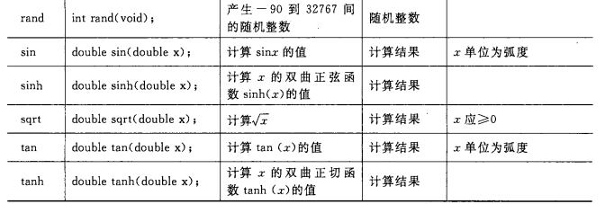

# snort

Owner: xqer

从离线的pcap文件读取网络日志数据源

分析配置规则，并在snort.conf中配置明文输出报警日志 文件 指定报警日志log目录(或缺省log目录=/var/log/snort)

使用命令

snort -r listen.pcap -c /etc/snort/snort.conf -K ascii

即可实现从listen.pcap读取网络日志，利用snort.conf的配置规则，默认以ascii形式输出到/var/log/snort

查看结果

**攻击机使用了nmap扫描工具并使用了DDOS攻击**