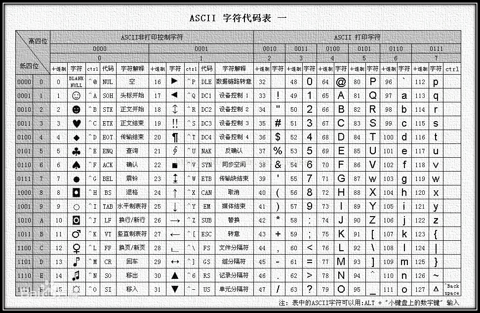

# 嗅探

Owner: xqer

攻击方用nmap扫描（达到特定目的），防 守方tcpdump嗅探，用wireshark分析， 并分析出攻击方的扫描目的以及每次扫描使 用的nmap命令。

# nmap扫描

## 端口探测

130主机用nmap 扫描129主机 发现ssh端口开启服务

在129主机开启tcpdump

发现130的扫描报文

首先130向路由器2发送arp报文，寻找129主机mac地址

然后130向129主机ftp，smtp，http，ssh等常用端口发送探测报文，之后向所有端口发送探测报文。

可以看到，扫描机用的是namp的端口探测扫描功能

## 特定端口探测

这次扫描机只向ssh端口发送了报文 可以推测使用的命令是 nmap **** -p ssh

## 快速扫描和不随机扫描

加-F后，报文数从

变为

## sU udp扫描

这是加了-sU后的报文

- sA ACK端口扫描

# wireshark分析

wireshark得到一样的结果

过滤出答复报文

可以看到，22号端口的答复报文seq和win mss字段与其余的都不相同，扫描机通过这些信息检测端口是否开启服务。