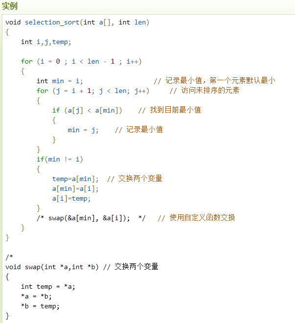
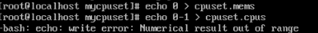

# 实验二

Owner: xqer

# 安装虚拟机软件（Virtualbox或VMware）

之前已经安装好

靶机：Metasploitable3等或自定义

DVWA靶场（步骤参考实验讲义）

安装phpstudy

放入dvwa文件夹

修改php配置文件

攻击机：Kali（[https://www.kali.org/）或自定义](https://www.kali.org/%EF%BC%89%E6%88%96%E8%87%AA%E5%AE%9A%E4%B9%89)

虚拟机kali开启ssh 用vscode连接

攻击机、靶机在虚拟机软件环境中能够网络通信（虚拟网络的 配置）

kali和metasploitable2都设置为nat模式，通过vmware网关与外界通信，二者之间在一个局域网，可以直接通信

再安装metasploitablexp

寻找flag

1.信息搜集

攻击机ip 192.168.18.129

靶机192.168.18.130

利用ftp后门漏洞获取到了shell

