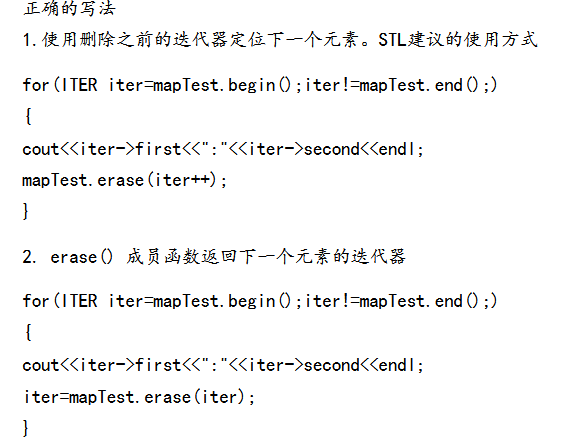

# 防火墙

Owner: xqer

虚拟机1：SEED：192.168.18.137 虚拟机2：SEED2：192.168.18.140 虚拟机3：SEED3

首先开起两个虚拟机，用VM1 telnet 远程连接 VM2

退出telnet，查看VM1的防火墙状态

# 配置防火墙阻止VM1远程连接VM2

添加防火墙规则

一直停留在这个语句

删除后立马能连接了

## 配置VM1规则，阻止访问某一网站

操作被禁止

## 同理可以配置阻止SSH连接的防火墙规则

# 绕过防火墙

此操作是通过140作为代理，连接141

8000端口与141：23绑定了

成功绕过了防火墙

# 绕过防火墙2

VM1上面建立 index.html网页

删除所有规则

禁止80和22端口

vm2无法访问vm1

建立反向隧道

可以访问了

参考

[深入浅出：SSH端口转发](https://zhuanlan.zhihu.com/p/404855002#:~:text=%E6%B7%B1%E5%85%A5%E6%B5%85%E5%87%BA%EF%BC%9ASSH%E7%AB%AF%E5%8F%A3%E8%BD%AC%E5%8F%91%201%20%E7%AE%80%E4%BB%8B%20SSH%E7%9A%84%E7%AB%AF%E5%8F%A3%E8%BD%AC%E5%8F%91%E4%B8%BB%E8%A6%81%E6%9C%89%E4%B8%89%E7%A7%8D%EF%BC%9A%E6%9C%AC%E5%9C%B0%E7%AB%AF%E5%8F%A3%E8%BD%AC%E5%8F%91%E3%80%81%E8%BF%9C%E7%A8%8B%E7%AB%AF%E5%8F%A3%E8%BD%AC%E5%8F%91%E3%80%81%E5%8F%8A%E5%8A%A8%E6%80%81%E7%AB%AF%E5%8F%A3%E8%BD%AC%E5%8F%91%EF%BC%8C%E5%88%86%E5%88%AB%E9%80%9A%E8%BF%87SSH%E7%9A%84%20-L%20%E3%80%81%20-R%20%E3%80%81,7%20%E7%BD%91%E7%BB%9C%E7%8E%AF%E5%A2%83%20...%208%20%E5%AE%9E%E8%B7%B5%E4%B8%8E%E5%88%86%E6%9E%90%20...%20More%20items)