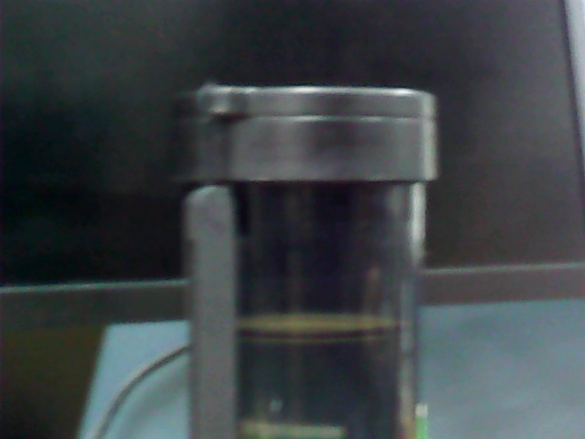
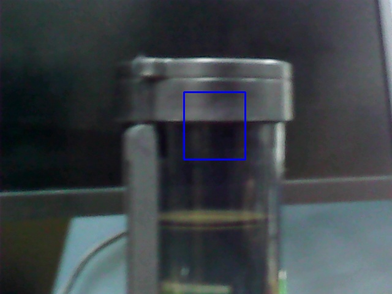
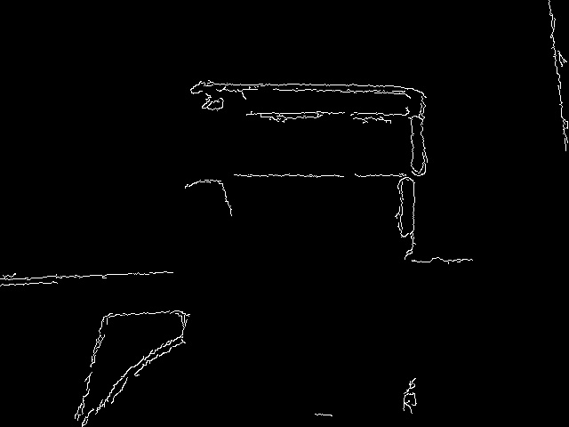
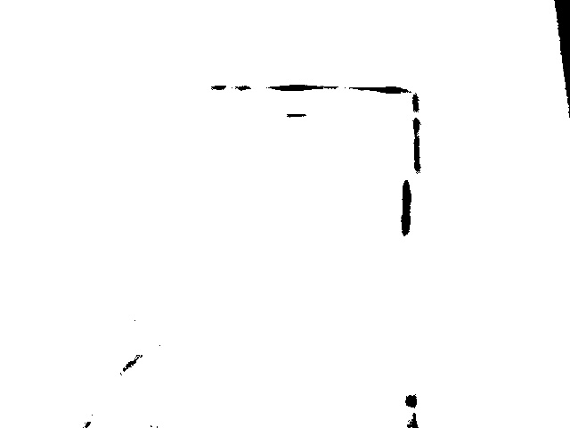
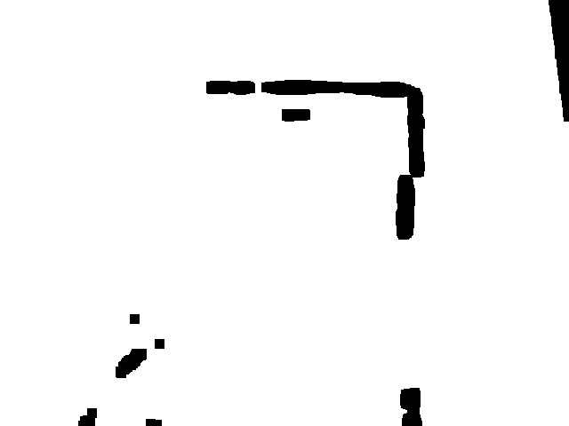
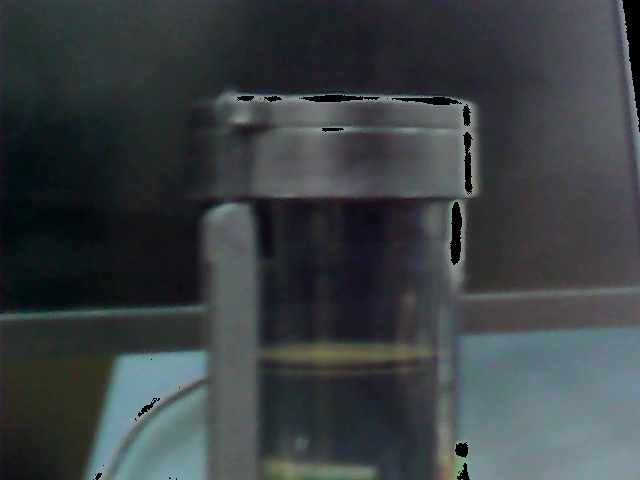

# 机器视觉

Owner: xqer


# 捕捉图片

```
import cv2
from datetime import datetime
cap=cv2.VideoCapture(0)
ret,frame= cap.read()
timestamp= datetime.now().isoformat()
cv2.imwrite('%s.jpg'% timestamp,frame)
print("ok!")
```




# 高斯滤波

```
import imutils
import cv2
image= cv2.imread("1.jpg")
(h, w, d) = image.shape
print("width={}, height={},depth={}".format(w,h,d))
blurred= cv2.GaussianBlur(image,(11,11),0)
cv2.imwrite("blurred.jpg", blurred)
```


变模糊了一些，文件大小也变小了

# 添加方框

```
import imutils
import cv2
image= cv2.imread("1.jpg")
output=image.copy()
cv2.rectangle(output,(300,150),(400,260),(255,0,0),2)

#cv2.putText(output,"nosense text and nosense lines",(350,100),)
cv2.imwrite("1withrectangle.jpg", output)
```



# 边缘检测

```
import cv2
image= cv2.imread("1.jpg")
gray=cv2.cvtColor(image,cv2.COLOR_BGR2GRAY)
edged=cv2.Canny(gray,30,150)
cv2.imwrite("edged.jpg",edged)
```



# 阈值处理

由于图片偏黑，所以阈值设置应该小点

```
import cv2
image= cv2.imread("1.jpg")
gray=cv2.cvtColor(image,cv2.COLOR_BGR2GRAY)
retval,thresh=cv2.threshold(gray,150,255,cv2.THRESH_BINARY_INV)
cv2.imwrite("Thresh.jpg",thresh)
```



# 腐蚀和膨胀

```
import cv2
image= cv2.imread("1.jpg")
gray=cv2.cvtColor(image,cv2.COLOR_BGR2GRAY)
retval,thresh=cv2.threshold(gray,150,255,cv2.THRESH_BINARY_INV)
mask=thresh.copy()
mask=cv2.erode(mask,None,iterations=5)
cv2.imwrite("eroded.jpg",mask)
```



# 蒙版

```
import cv2
image= cv2.imread("1.jpg")
gray=cv2.cvtColor(image,cv2.COLOR_BGR2GRAY)
retval,thresh=cv2.threshold(gray,150,255,cv2.THRESH_BINARY_INV)
mask=thresh.copy()
output2=cv2.bitwise_and(image,image,mask=mask)
cv2.imwrite("mask.jpg",output2)
```



