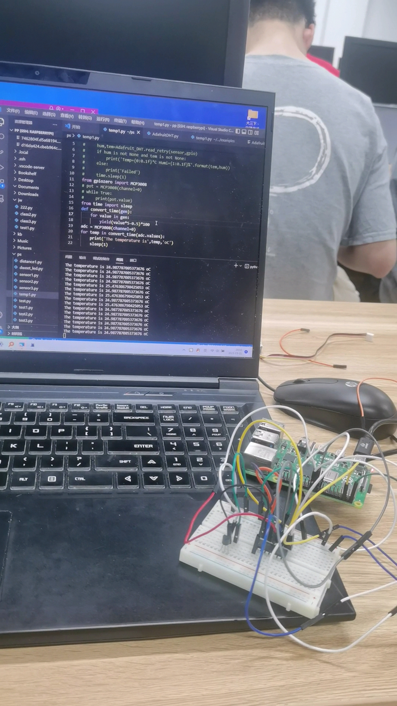

# 温度传感器+摔跤检测

Owner: xqer

# 温度检测：

测量环境温度，单位摄氏度


根据连线图完成spi的连线，再加入tem36温度传感器



代码如下：

```

```

如视频所示，成功获取了当前的温度

- 注意分析ADC输入电压值转化成温度值的计算，并写入报告

我们使用的vref是5v

pot.value=Vout/Vref

Vout=pot.value*5


我们使用的是tem36，voltage与temperature 温度关系如图所示，

Voltage = 0.01*temperature+0.5

temperature = (voltage-0.5)*100=(pot.value*5-0.5)*100

# 摔跤检测


原理：

1 加速度阈值判别环节 SVM 代表总体加速度的幅值。设定阈值为 0.9g，如果采样点的 SVM 值小于 0.9g，则进入下一环节进行判断。 2时间阈值判别环节 连续满足 SVM ＜ 0。9 的采样点数目与时间成正比，对 时间 T 可以设定一个阈值，取其值为 0． 35 s。如果 T ＞ 0.35 s，则可以认定该组数据是一组摔倒的可疑数据，进入下一环节进行判定。3均值阈值判别环节在 0． 35 s 内一直满足 SVM ＜0． 9 的条件已经比较苛刻，经过实验证明，在步行、下楼过程中仍然有一定几率出现误报，于是又加入了第三个环节。即在过去 0． 35 s 内的加速度均值 G 如果小于 0． 7，则认为跌倒事件发生,报警


代码如下，用滑动窗口实现，窗口长度为35，每0.01秒采集一次数据

```
import adxl345
import time
import RPi.GPIO as GPIO
from gpiozero import LED,Button
#import thread
# 设置 GPIO 模式
GPIO.setmode(GPIO.BCM)
RED_PIN = 16
GPIO.setup(RED_PIN, GPIO.OUT)
GPIO.output(RED_PIN, GPIO.LOW)
address=0x53
adxl345=adxl345.ADXL345()
register=0x32
suspicioustime=0
threshold=0.9
slidewindow=[]
alltime=0
averageG=0
def average(lst):
    return sum(lst)/len(lst)
while True:
    axes = adxl345.getAxes(True)
    alltime+=1
    a=(axes['x']**2+axes['y']**2+axes['z']**2)**0.5
    length=len(slidewindow)
    if(length<35):
        slidewindow.append(a)
    else:
        removed=slidewindow.pop(0)
        slidewindow.append(a)
    averageG=average(slidewindow)
    print ("average acceleration %lf:" % (averageG))
    if (a>threshold):
        suspicioustime+=1
        if(suspicioustime>=35 and averageG<0.7):
            print("mayday")
            GPIO.output(RED_PIN, GPIO.HIGH)
            break
    else:
        suspicioustime=0
    #print ("   x = %.3fG" % ( axes['x'] ))
   # print ("   y = %.3fG" % ( axes['y'] ))
   # print ("   z = %.3fG" % ( axes['z'] ))
    time.sleep(0.01)
```

结果如视频所示