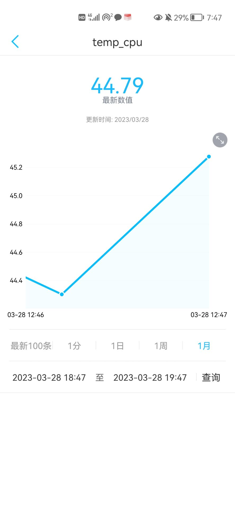

# 物联网

Owner: xqer

cpu温度上传到onenet


手机上：



温度还是比较高的

# 环境温度上传

```
# -*- coding:utf-8 -*-
# File: lab_cputemp.py
#向onenet平台已经创建的数据流发送数据点
import urllib.request
import json
import time
import datetime

APIKEY = '3ar293Z2Q3qfSsv355AW5Muevjo='  #改成你的APIKEY,需要在设备里创建
from gpiozero import MCP3008
from time import sleep
adc = MCP3008(channel=0)
def get_temp():
        for value in adc.values:
                yield (value*5-0.5)*100

temperaturegener=get_temp()
def http_post():
    global temperaturegener
    temperature = next(temperaturegener)  #获取CPU温度并上传
    CurTime = datetime.datetime.now()
    url='http://api.heclouds.com/devices/1062975501/datapoints'
    values={'datastreams':[{"id":"temp_cpu","datapoints":[{"at":CurTime.isoformat(),"value":temperature}]}]}

    print ("当前的ISO时间为: %s" %CurTime.isoformat())
    print ("上传的温度值为: %.3f" %temperature)

    jdata = json.dumps(values)                  # 对数据进行JSON格式化编码，生成的是字符串
    #打印json内容
    print (jdata)
    data = bytes(jdata, 'utf-8')
    request = urllib.request.Request(url, data)
    request.add_header('api-key', APIKEY)
    request.get_method = lambda:'POST'          # 设置HTTP的访问方式
    request = urllib.request.urlopen(request)
    return request.read()

while True:
        time.sleep(1)
        resp = http_post()
        print ("OneNET请求结果:\n %s" %resp)
        time.sleep(2)
```

# 距离上传：

```
# -*- coding:utf-8 -*-
# File: lab_cputemp.py
#向onenet平台已经创建的数据流发送数据点
import urllib.request
import json
import time
import gpiozero
from gpiozero import DistanceSensor,LED
from time import sleep
import datetime
sensor = DistanceSensor(23,24,max_distance=1,threshold_distance=0.05)
APIKEY = '3ar293Z2Q3qfSsv355AW5Muevjo='  #改成你的APIKEY,需要在设备里创建

def get_distance():
        # 打开文件
        file = open("/sys/class/thermal/thermal_zone0/temp")
        # 读取结果，并转换为浮点数
        temp = float(file.read()) / 1000
        # 关闭文件
        file.close()
        # 向控制台打印结果
        print ("距离值为: %.3f" %temp)
        # 返回温度值
        return temp

def http_post():
    temperature = sensor.distance #获取CPU温度并上传
    CurTime = datetime.datetime.now()
    url='http://api.heclouds.com/devices/1062975501/datapoints'
    values={'datastreams':[{"id":"temp_cpu","datapoints":[{"at":CurTime.isoformat(),"value":temperature}]}]}

    print ("当前的ISO时间为: %s" %CurTime.isoformat())
    print ("上传的距离值为: %.3f" %temperature)

    jdata = json.dumps(values)                  # 对数据进行JSON格式化编码，生成的是字符串
    #打印json内容
    print (jdata)
    data = bytes(jdata, 'utf-8')
    request = urllib.request.Request(url, data)
    request.add_header('api-key', APIKEY)
    request.get_method = lambda:'POST'          # 设置HTTP的访问方式
    request = urllib.request.urlopen(request)
    return request.read()

while True:
        time.sleep(1)
        resp = http_post()
        print ("OneNET请求结果:\n %s" %resp)
        time.sleep(1)
```

接线及运行结果见视频所示