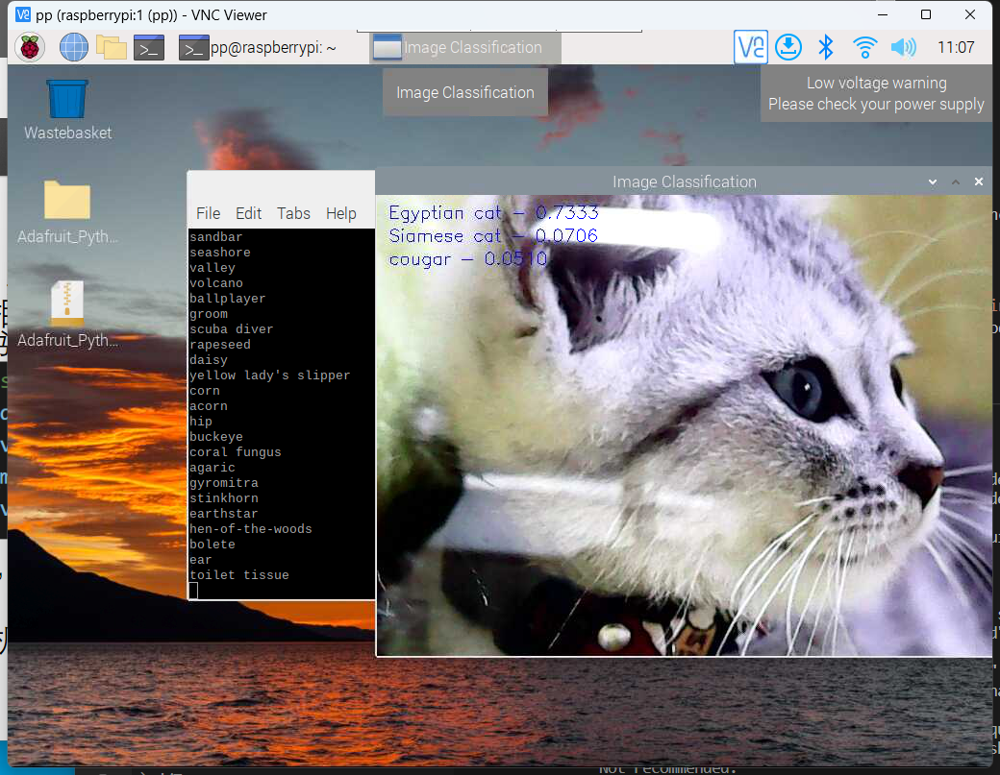

# 神经网络部署

Owner: xqer


安装tflite ，tflite-runtime 等库 连接 vnc

```
"""
Run classification on Camera, Press ESC to exit the program
For Raspberry PI, please use `import tflite_runtime.interpreter as tflite` instead
"""
import cv2
import numpy as np

#import tensorflow.lite as tflite
import tflite_runtime.interpreter as tflite

from PIL import Image

CAMERA_WIDTH = 640
CAMERA_HEIGHT = 480

def load_labels(label_path):
    r"""Returns a list of labels"""
    with open(label_path, 'r') as f:
        return [line.strip() for line in f.readlines()]

def load_model(model_path):
    r"""Load TFLite model, returns a Interpreter instance."""
    interpreter = tflite.Interpreter(model_path=model_path)
    interpreter.allocate_tensors()
    return interpreter

def process_image(interpreter, image, input_index, k=3):
    r"""Process an image, Return top K result in a list of 2-Tuple(confidence_score, _id)"""
    input_data = np.expand_dims(image, axis=0)  # expand to 4-dim

    # Process
    interpreter.set_tensor(input_index, input_data)
    interpreter.invoke()

    # Get outputs
    output_details = interpreter.get_output_details()
    output_data = interpreter.get_tensor(output_details[0]['index'])
    # print(output_data.shape)  # (1, 1001)
    output_data = np.squeeze(output_data)

    # Get top K result
    top_k = output_data.argsort()[-k:][::-1]  # Top_k index
    result = []
    for _id in top_k:
        score = float(output_data[_id] / 255.0)
        result.append((_id, score))

    return result

def display_result(top_result, frame, labels):
    r"""Display top K result in top right corner"""
    font = cv2.FONT_HERSHEY_SIMPLEX
    size = 0.6
    color = (255, 0, 0)  # Blue color
    thickness = 1

    for idx, (_id, score) in enumerate(top_result):
        # print('{} - {:0.4f}'.format(label, score))
        x = 12
        y = 24 * idx + 24
        cv2.putText(frame, '{} - {:0.4f}'.format(labels[_id], score),
                    (x, y), font, size, color, thickness)
        print(labels[_id])

    cv2.imshow('Image Classification', frame)

if __name__ == "__main__":

    model_path = 'mobilenet_v1_1.0_224_quant.tflite'
    label_path = 'labels_mobilenet_quant_v1_224.txt'

    cap = cv2.VideoCapture(0)
    cap.set(cv2.CAP_PROP_FRAME_WIDTH, CAMERA_WIDTH)
    cap.set(cv2.CAP_PROP_FRAME_HEIGHT, CAMERA_HEIGHT)
    cap.set(cv2.CAP_PROP_FPS, 15)

    interpreter = load_model(model_path)
    labels = load_labels(label_path)

    input_details = interpreter.get_input_details()

    # Get Width and Height
    input_shape = input_details[0]['shape']
    height = input_shape[1]
    width = input_shape[2]

    # Get input index
    input_index = input_details[0]['index']

    # Process Stream
    while True:
        ret, frame = cap.read()

        image = Image.fromarray(cv2.cvtColor(frame, cv2.COLOR_BGR2RGB))
        image = image.resize((width, height))

        top_result = process_image(interpreter, image, input_index)
        display_result(top_result, frame, labels)

        key = cv2.waitKey(1)
        if key == 27:  # esc
            break

    cap.release()
    cv2.destroyAllWindows()
```



图中可以看到识别出了标签为埃及猫

模型可以识别出猫狗，但是不能识别数字，因为标签里没有数字

因此，我实现了识别出猫，电机正转，识别出狗，电机反转，添加的代码如下

```
from gpiozero import Motor
from time import sleep
from signal import pause
# 定义Motor对象
motor = Motor(forward=22, backward=23)

***#修改display_result函数
def display_result(top_result, frame, labels):
    r"""Display top K result in top right corner"""
    font = cv2.FONT_HERSHEY_SIMPLEX
    size = 0.6
    color = (255, 0, 0)  # Blue color
    thickness = 1

    for idx, (_id, score) in enumerate(top_result):
        # print('{} - {:0.4f}'.format(label, score))
        x = 12
        y = 24 * idx + 24
        cv2.putText(frame, '{} - {:0.4f}'.format(labels[_id], score),
                    (x, y), font, size, color, thickness)
        if("cat" in labels[_id]):
          motor.forward()
          sleep(2)
        elif ("dog" in labels[_id]):
          motor.backward()
          sleep(2)

    cv2.imshow('Image Classification', frame)

***
```

# 思考

## 1、影响神经网络模型识别准确性的因素都有哪些？

**1、数据集问题**

- 数据集中缺失值过多
- 数据集每个类别的样本数目不均衡
- 数据集中存在异常值
- 数据集中的数据对预测结果帮助不大（例如使用年龄预测性别）

**2、数据处理算法设计和实现问题**

- 数据处理参数有误
- 未对数据进行归一化
- [特征提取算法](https://www.zhihu.com/search?q=%E7%89%B9%E5%BE%81%E6%8F%90%E5%8F%96%E7%AE%97%E6%B3%95&search_source=Entity&hybrid_search_source=Entity&hybrid_search_extra=%7B%22sourceType%22:%22answer%22,%22sourceId%22:1756228139%7D)（如果使用了）存在错误
- train和validation数据处理方式不一致

**3、算法设计和实现问题**

- API使用错误
1. 没有遵循深度学习框架约束
2. 算子使用错误
- 计算图结构错误
1. [权重共享错误](https://www.zhihu.com/search?q=%E6%9D%83%E9%87%8D%E5%85%B1%E4%BA%AB%E9%94%99%E8%AF%AF&search_source=Entity&hybrid_search_source=Entity&hybrid_search_extra=%7B%22sourceType%22:%22answer%22,%22sourceId%22:1756228139%7D)
2. 权重冻结错误（例如忘记冻结应冻结的权重）
3. 节点连接错误（例如应连接在图中的节点未连接）
- [loss函数](https://www.zhihu.com/search?q=loss%E5%87%BD%E6%95%B0&search_source=Entity&hybrid_search_source=Entity&hybrid_search_extra=%7B%22sourceType%22:%22answer%22,%22sourceId%22:1756228139%7D)错误
- 优化器错误
- 权重初始值错误
- 算法本身设计有缺陷导致精度无法达到预期。

**4、超参设置问题**

**5、普通python编程错误**

**6、环境问题**

- 依赖软件问题
- 环境变量配置问题
- 云上环境问题

## 2、运行神经网络识别物体会出现误识别的情况，思考采取哪些措施可以尽量避免这一问题

1. 提高数据的质量：网络的训练数据质量对于网络的性能有很大的影响。采集数据时，需要尽量保证数据的准确性和完整性，避免出现噪声和异常值。同时，也可以采用数据扩增等技术来增加数据量，改善数据质量。
2. 选择合适的网络结构：选用合适的网络结构也是保证网络性能的一个关键因素。不同的网络结构适用于不同的问题，需要根据具体情况选择合适的网络结构。
3. 调整超参数：网络的超参数设置对网络性能也有重要的影响。可以通过网格搜索等方法来确定最优超参数的组合，以提高网络性能和减少误识别。
4. 引入预训练模型：预训练模型可以实现迁移学习，利用已有的大数据集进行预训练，然后在小数据集上进行微调。这种方法可以大大提高网络的鲁棒性和泛化能力，从而减少误识别的问题。
5. 采用集成学习方法：集成学习可以将多个模型的预测结果进行加权平均，从而降低误识别的概率。可以通过采用不同的网络结构或使用不同的超参数，再对不同的模型进行集成，提高网络的准确性和鲁棒性。