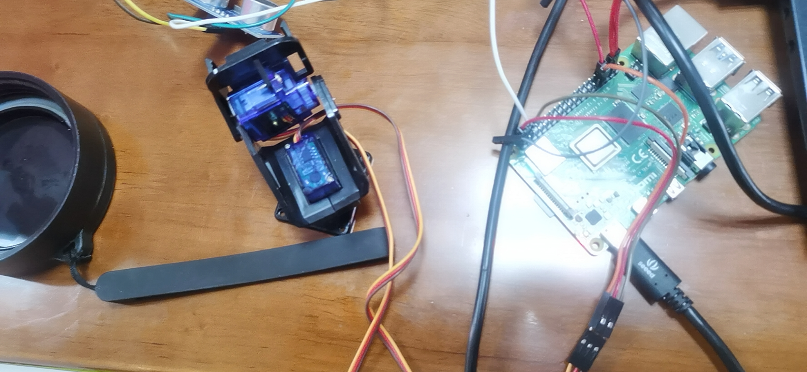
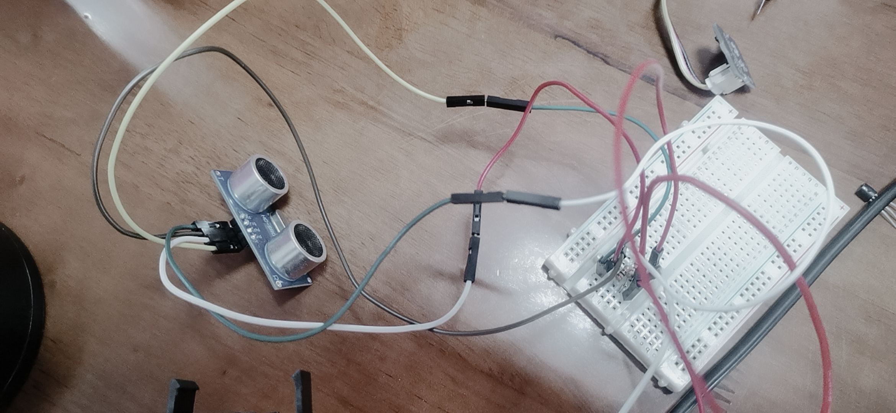
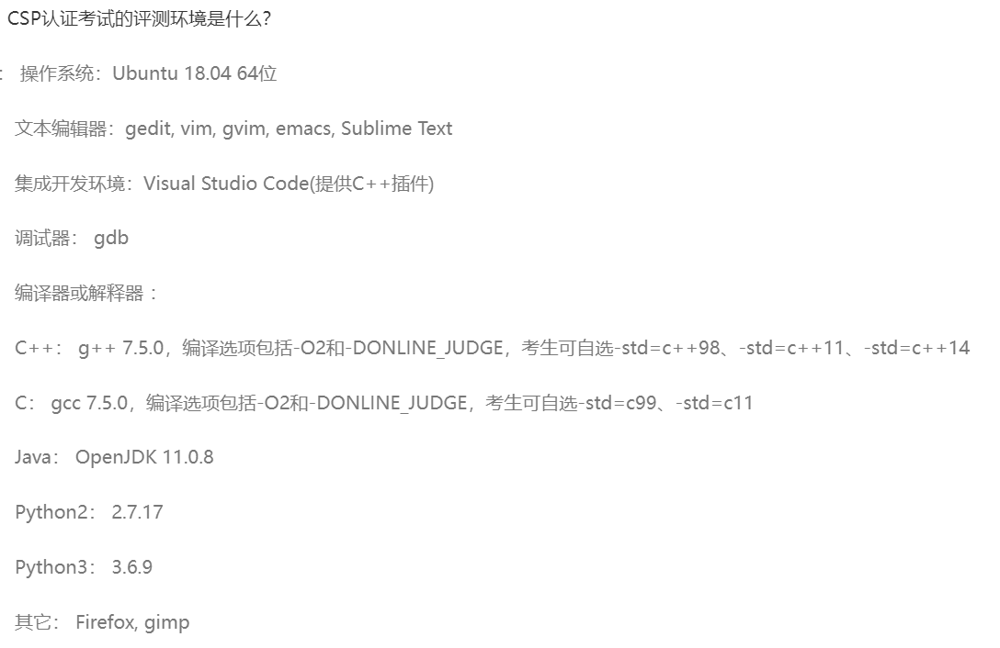

# 超声云台雷达

Owner: xqer

在掌握舵机使用的基础上，驱动舵机云台，结合超声测距传感器水平方向摆动扫描，实现对一定范围内物体的模拟雷达图展示要求：图中能够展示目标物体的位置，给出具体极坐标信息（距离、角度），并能够动态刷新

# 舵机接线



按照指导接好线

# 距离传感器接线



## 使舵机水平摆动，并获取位置和角度

```
from gpiozero import AngularServo, DistanceSensor
from time import sleep
servo =AngularServo(13,min_angle=0,max_angle=360)
sensor = DistanceSensor(21,20,max_distance=1,threshold_distance=0.05)

i=0
while True:
    if i>360:
        i=0
    servo.angle=i
    sleep(0.5)
    i=i+20
    print('Distance to nearest object is%f angle is %d',sensor.distance,i,'m')
```



结果如视频所示，对于不同位置放置的瓶子，杯子，书本，该系统都可以测出其位置和角度


最终获取的距离如下（从右到左）

瓶子和书本最远，水杯最近，中间的缝隙是没有回波，所以距离是1

[**0.2082143076446664, 0.21089997389224663, 0.20873880868513878, 0.20976532786409735, 0.2131438643527872, 0.20963197143757498**, 1.0, 0.13392237401341844, 0.10778449818099034, 0.0949982346170691, 0.09251921088951348, 0.09504285856954084, 0.09122254629381132, 0.09708971800060681, **0.20013842933329215, 0.20297667498849478, 0.2095779080129796, 0.22544063902596462**, 1.0]

## 画出雷达图

利用matplotlib的动画对象，一边获取位置信息一边绘制雷达图，结果见视频，


代码如下

```
from gpiozero import AngularServo, DistanceSensor
from time import sleep
servo =AngularServo(13,min_angle=0,max_angle=360)
sensor = DistanceSensor(21,20,max_distance=1,threshold_distance=0.05)

i=0
dis=[]
ang=[]
import numpy as np
import matplotlib.pyplot as plt
import matplotlib.animation as animation

# 雷达图的绘制函数
def plot_radar(ax, ranges, angles):
    # 设置极坐标系
    ax.set_theta_zero_location('N')
    ax.set_theta_direction(-1)
    ax.set_rlim([0, np.max(ranges)*1.1])
    ax.set_rticks(np.arange(0, np.max(ranges)*1.1, np.max(ranges)/4))
    ax.grid(True)

    # 绘制雷达图
    ax.plot(angles, ranges, linewidth=2)
    ax.fill_between(angles, 0, ranges, alpha=0.1)

    # 设置标题
    ax.set_title('Radar Plot')

# 创建图形对象
fig = plt.figure()
ax = fig.add_subplot(111, polar=True)

new_ranges=[]
angles=[]
times=0
# 定义动画函数
def update(i):
    # 生成新的随机数据
    global times
    times+=1
    if(times==19):
       break
    tem=sensor.distance
    if tem==1.0:#把距离太远的地方设为0
       new_ranges.append(0)
    else:
       new_ranges.append(tem)
    angles.append(np.pi/18*(times-1))
    plot_radar(ax, new_ranges, angles)

# 创建动画对象
ani = animation.FuncAnimation(fig, update, frames=10, interval=1000)

# 显示图形
plt.show()
```