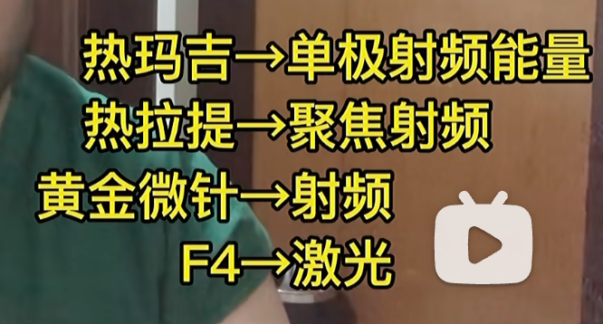
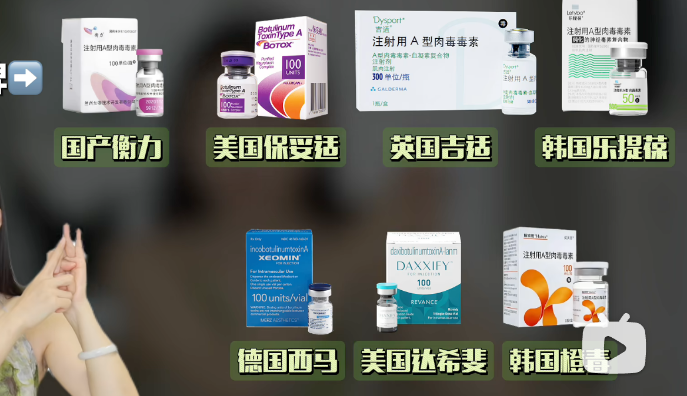
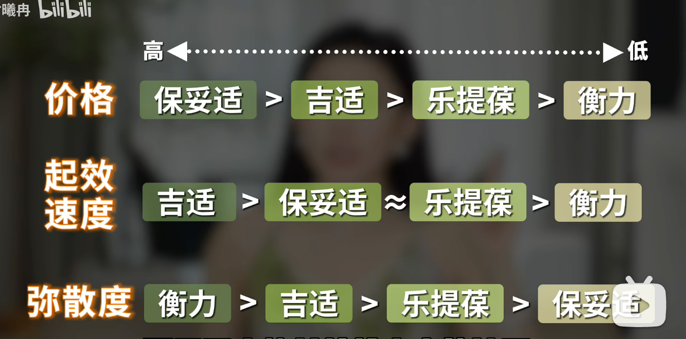
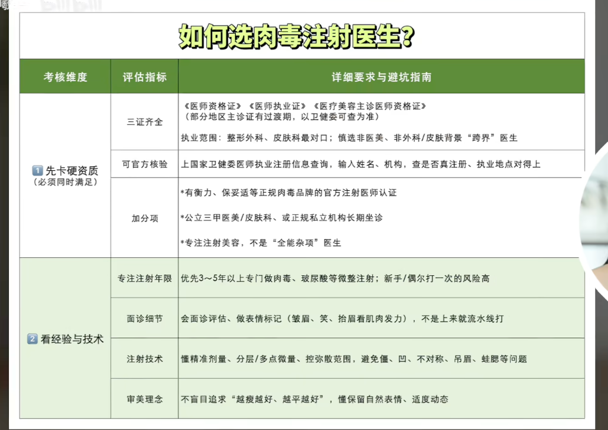
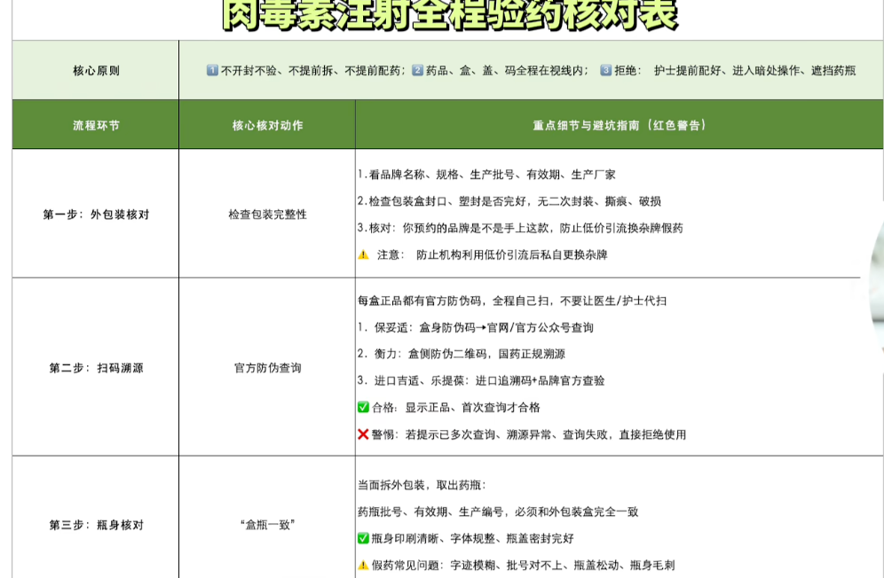
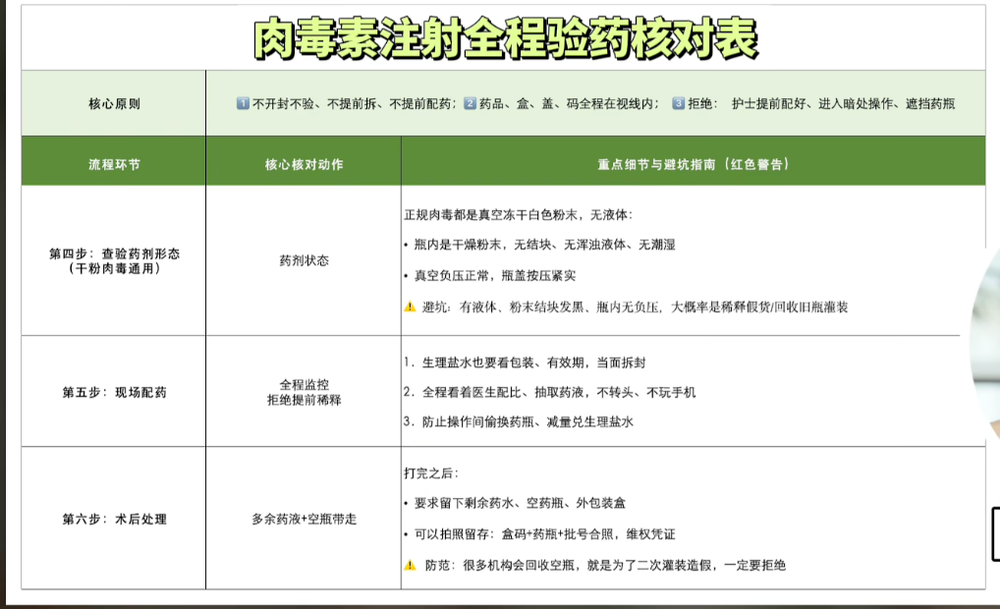

热玛吉鼻子眼睛提肌 近视手术 发际线 超声刀 牙齿矫正

光电

超声炮 热玛吉等等 效果差不多 超声刀国内违法

玻尿酸 填充，对于额颞部 苹果肌 法令纹 颏部效果好，但是要考虑后期吸收，异物反应
长远看比脂肪填充贵不少
玻尿酸+ XXX 少女针 童颜针 等等

美白 超皮秒 光子 重要加能量  波长不同
## 肉毒
在微调领域，肉毒素（Botox） 是长青项目 💉 建议一年打两次咬肌，不仅能柔化下颌线条，对颞颌关节不适、咀嚼肌肥大也有很好的缓解作用 ❄️ 这种基础项目选择平价款即可，医生会根据左右脸不对称的情况精准分配剂量 🌊
打咬肌+ 下颌缘提升 （英伦大提升说的就是这个）、眼角细纹，抬头纹等等

国产衡力性价比高
弥散度大打大肌肉，反正精细化
重点看白大褂和验药

 副作用：打多了，面部僵硬不自然 位置不对 可能脸颊凹陷

避雷：5个不推荐的医美项目 鼻部玻尿酸填充 (Nose Filler) 👃 玻尿酸具有流动性且受重力影响。鼻梁处缺乏骨性支撑，多次反复注射后，填充物容易向两侧扩散，导致鼻梁变宽（变“阿凡达”鼻），且鼻尖容易因压力而下垂。若追求长期效果，频繁补打的性价比与风险并不理想。 卧蚕填充 👀 卧蚕部位的皮肤极薄。注射玻尿酸后，一旦发生位移或下垂，会撑松下眼睑的皮肤。即使后续将填充物溶解，被撑开的皮肤也难以自行回缩，容易形成明显的褶皱或眼袋感，修复难度极大。 鼻翼肉毒素 💉 该项目旨在通过麻痹肌肉来缩小鼻翼。但鼻翼处的肌肉群非常细小，注射时的疼痛感极强，且对于大多数人来说，视觉上的缩小效果微乎其微。除非是鼻翼动态收缩异常剧烈的人群，否则其性价比极低。 含类固醇的轮廓针 (溶脂针) 🧬 传统的溶脂针若含有类固醇成分，容易引起内分泌紊乱，导致非经期出血或月经不调。建议咨询时明确确认是否为“无类固醇”产品。通常清澈透明的药液多为不含类固醇的，而浑浊不透明的则需警惕。 海藻焕肤 (阿拉丁焕肤) 🌊 该项目痛感极强，类似细小砂砾在皮肤上用力揉搓。术后会有长达两周的脱皮期，伴随剧烈的瘙痒和角质掉落。对于很多人来说，其改善毛孔或痘痘的效果并不显著，反而可能因为剥脱力度过大导致皮肤屏障受损、变薄。 🏥 韩国医美选医院小Tips 避开低价流水线医院 🚩 App上价格极低、顾客多到拥挤、咨询时间极短的医院通常是“流水线”作业。医生在施术前甚至没有时间仔细观察你的脸型，这种缺乏针对性的操作很容易导致效果不佳（如千篇一律的唇形）。 比起“套餐”更建议“单次”尝试 🧪 不要被低价的多疗程套餐捆绑。建议先以单次施术体验医院的服务、医生的技术和术后效果，对比几家后再决定长期在那一家停留。 优先选择“院长面谈”的医院 👨‍⚕️ 如果一家医院只安排咨询室长沟通，付完钱直接进操作间看医生，请保持警惕。能够安排院长亲自面诊，并根据个人面部比例给出建议的医院，专业度和负责程度更高。 🗣️ 医美商谈技巧 警惕不停推销项目的行为 好的医生会根据你的实际需求劝退不必要的项目。如果咨询过程中，对方无视你的基础情况，一味引导你增加额外项目以提高客单价，建议果断拒绝。 明确表达困扰点，不做“伸手党” 🎯 去面诊前，要清楚自己最想改善的部位（如：侧颧骨突、鼻基底凹陷等）。具体的诉求能帮助医生给出更精准的方案。直接问“我怎么变美”往往得不到深度且适合的建议。 多问一句“差异在哪里” 🧐 当室长推荐你将两个项目组合时，一定要询问：“只做这个和两个一起做，具体的视觉差异在哪里？”弄清楚原理再做决定，避免花冤枉钱。

## 法令纹

法令纹的三大主要类型 了解自己的类型是避雷的第一步： 📍 1型：皮肤变薄产生的细纹 主要表现为干燥、卡粉，即使不笑时也能看到浅浅的纹路。这通常是因为皮肤胶原蛋白流失、表皮变薄导致的。 📍 2型：结构性凹陷 天生嘴凸、苹果肌扁平，或是鼻翼两侧基底骨骼凹陷。这种类型并非单纯的皱纹，而是因为结构不平整产生的阴影。随着年龄增长，骨骼轮廓更突出，视觉上法令纹会更深。 📍 3型：脂肪堆积与下垂 法令纹上方的苹果肌肉过多或皮肤松弛下垂，堆积在法令纹上方，形成明显的阶梯感，使下方显得凹陷。 不同类型的针对性方案建议 针对以上类型，各种医美项目的实际反馈如下： 📍 针对1型（细纹类）：水光针（Skin Booster） 代表项目： 丽珠兰（Rejuran）、乔雅露（Juvelook）蓝瓶、Jalupro等。 效果： 通过手工注射营养成分，能淡化细纹、改善肤质。 注意： 单次效果维持时间较短（约3个月），需多次累积（3-4次）才能达到显著改善。 光电辅助： 热玛吉（Thermage）对细纹有紧致效果，但在改善法令纹方面的性价比和即刻感不如水光针。 📍 针对2型（结构凹陷类）：胶原蛋白增生剂 推荐方案： 乔雅露（Juvelook）黑瓶。它不同于传统玻尿酸，是促进自身胶原蛋白增生的填充方式。 避雷提醒： 不建议在法令纹处注射玻尿酸。 这一部位活动量极大（说话、大笑），玻尿酸容易发生移位或导致表情僵硬。若移位至上方，反而会让法令纹看起来更深。 光电慎选： 骨骼不饱满的人应慎做超声刀（Ultherapy）或韩版超声刀（Shurink），因为这类消脂类项目会让皮肤更紧贴骨骼，可能加重凹陷感。 📍 针对3型（脂肪下垂类）：微脂肪去除与线雕 微脂肪去除： 针对法令纹上方堆积的沉重肉感，通过微小手术去除少量脂肪，能让面部视觉上变得轻盈。 线雕提拉： 通过物理线材将下垂的组织斜向上提拉，对改善嘴角肉和法令纹有一定效果，但需理性看待，效果并非如想象中那般剧烈。

## 水光针
  
🌟 丽珠兰 (Rejuran)：它是主打PN成分的修复神器！主要针对的是皮肤表面的直观问题，比如皮肤炎症、容易泛红、干敏起皮等等。如果你觉得皮肤屏障受损，或者想要那种透亮的“水光感”，选它就对了！它是那种由内而外帮你把受损表皮修护好的感觉，皮肤状态越差，用它效果越惊艳！✨
 re2o (真皮增强)：这可是现在的黑科技“皮肤重建术”！它用的是无细胞的真皮组织，打的层次比丽珠兰更深。如果说丽珠兰是修补外墙，那re2o就是强化真皮层的“钢筋支架”。它特别适合皮肤开始松弛、下垂、或者有严重毛孔问题的姐妹，直接帮你重建皮肤地基，让皮肤从底层厚实起来，紧致感直接拉满！🏗️ 💧 升级版水光针 (Revive / Hilowave等)：这些属于高端系列，里面含有交联剂的透明质酸补水成分。它们非常适合那种脸部极度缺水、干到快要裂开的姐妹。但要注意哦，因为有交联剂，如果不建议大家滥用或者频繁打太多，否则会像玻尿酸（填充剂）一样在脸上有所残留，一定要找专业医生评估量！⚠️ 💖 胶原针 (Juvelook黑瓶 / 塑颜萃童颜针)：这类项目跟普通水光针完全不同，它们是直接刺激你自己的胶原蛋白生成。如果你不仅想改善肤质，还希望皮肤能有一定的“增容感”，让干瘪的部位看起来更饱满、更有元气，那胶原针就是最好的选择！它能让你美得非常自然，就像回到了胶原蛋白满满的少女时期！元气感十足！🌸 更详细内容，点击视频确认 ~~