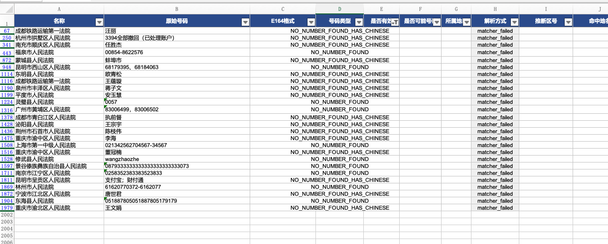

目前能力：
首先从字符串 文本中间提取号码，第二按规则校验合法性，第三按照E.164标准化表示
固定号码：区号2～3位 实际号码7～8位，会根据区号判断实际号码位数是否正确
移动电话： 位数校验，开头为 1 
共享付费电话： 有些不加区号的短号码被误判为共享付费电话（只有五位）法院公安局几乎不可能为这种类型

### 能否根据前三位判断？

在中国大陆手机号里，前三位通常叫做**号段**，例如：

- `130/131/132`：历史上多属于联通
- `134/135/136/137/138/139`：历史上多属于移动
- `133/153/189`：历史上多属于电信
- `170/171/162/165/167` 等：虚拟运营商/转售号段
- `192/195/196/197/198/199` 等：近年新增号段

但现在有几个问题：

1. **携号转网**存在，号码归属运营商可能和原始号段不一致。
2. 新号段会持续增加，手写号段表容易过期。
3. 有些号段需要看前 3 位，有些可能需要更细的规则。
4. “运营商号段存在”不等于“这个号码真实可用”。

所以，前三位可以用于**初步识别号段类型**，但不能作为严格合法性判断。


仍存在的问题：
没有分割符，分割符不合法，多个号码连在一起，难以提取，需要写更加精细的正则进行匹配
  

| 步骤  | 处理方式                         | 解析方式列标记             |
| --- | ---------------------------- | ------------------- |
| 1   | 直接 `PhoneNumberMatcher`      | `matcher(xN)`       |
| 2   | 替换非法分隔符（`·•★※` 等）→ matcher   | `matcher_clean(xN)` |
| 3   | 正则按号码格式切分（区号+本地号、手机、400/800） | `regex_split(xN)`   |
| 4   | 同区号重复出现时按"第二个区号位置切分"         | `regex_split(xN)`   |
```
=== 所有抢救成功的行 === 
021-6270-4567-4·67 021-6270-4567 +862162704567 FIXED_LINE True True CN regex_split(x1) 0771-28086850771-5679306 0771-2808685,0771-5679306 +867712808685,+867715679306 FIXED_LINE,FIXED_LINE True,True True,True CN,CN regex_split(x2) 057785108966-13396992193 057785108966,13396992193 +8657785108966,+8613396992193 FIXED_LINE,MOBILE True,True True,True CN,CN regex_split(x2) 0236543926302365439262023654 02365439263 +862365439263 FIXED_LINE True True CN regex_split(x1) 19163879858-07714306267 19163879858,07714306267 +8619163879858,+867714306267 MOBILE,FIXED_LINE True,True True,True CN,CN regex_split(x2) 0915-6320072-0915-63200902000 0915-6320072 +869156320072 FIXED_LINE True True CN regex_split(x1) 84190071-18740289694 18740289694 +8618740289694 MOBILE True True CN regex_split(x1) 02361226968-02361226962 02361226968,02361226962 +862361226968,+862361226962 FIXED_LINE,FIXED_LINE True,True True,True CN,CN regex_split(x2) 0393586589803935865898 03935865898 +863935865898 FIXED_LINE True True CN regex_split(x1)

```
 全部 10 个 2 位区号（直辖市/超大城市）
区号	城市
010	北京
020	广州
021	上海
022	天津
023	重庆
024	沈阳 / 抚顺 / 铁岭
025	南京
027	武汉
028	成都 / 眉山 / 资阳
029	西安 / 咸阳
#### 2. 40 个 3 位区号（重要省会和经济发达地市）

按省份归类：

| 省份             | 区号                                                                                  | 城市                                   |
| -------------- | ----------------------------------------------------------------------------------- | ------------------------------------ |
| **河北**         | `0311`                                                                              | 石家庄                                  |
| **河南**         | `0371` `0377` `0379`                                                                | 郑州、南阳、洛阳                             |
| **辽宁**         | `0411`                                                                              | 大连                                   |
| **吉林**         | `0431` `0432`                                                                       | 长春、吉林市                               |
| **黑龙江**        | `0451`                                                                              | 哈尔滨                                  |
| **江苏（11 个全部）** | `0510` `0511` `0512` `0513` `0514` `0515` `0516` `0517` `0518` `0519` `0523` `0527` | 无锡、镇江、苏州、南通、扬州、盐城、徐州、淮安、连云港、常州、泰州、宿迁 |
| **山东**         | `0531` `0532`                                                                       | 济南、青岛                                |
| **安徽**         | `0551`                                                                              | 合肥、巢湖                                |
| **浙江（7 个）**    | `0571` `0573` `0574` `0575` `0576` `0577` `0579`                                    | 杭州、嘉兴、宁波、绍兴、台州、温州、金华                 |
| **福建**         | `0591` `0595`                                                                       | 福州、泉州                                |
| **湖南**         | `0731`                                                                              | 长沙、湘潭、株洲                             |
| **广东**         | `0755` `0757` `0760` `0769`                                                         | 深圳、佛山/顺德、中山、东莞                       |
| **江西**         | `0791`                                                                              | 南昌                                   |
| **云南**         | `0871`                                                                              | 昆明                                   |
| **海南**         | `0898`                                                                              | 海口                                   |

### 二、同时支持 7 位和 8 位本地号（4 个）

这 4 个比较特殊，**新老号码并存**：

| 区号     | 城市       | 说明              |
| ------ | -------- | --------------- |
| `0433` | 延边、延吉、珲春 | 老号 7 位，新号 8 位   |
| `0435` | 通化、梅河口   | 老号 7 位，新号 8 位   |
| `0754` | 汕头、潮阳    | 已升 8 位，旧 7 位仍兼容 |
| `0851` | 贵阳、遵义、安顺 | 已升 8 位，旧 7 位仍兼容 |


## 做法

1. **构建"地名→区号"映射**（脚本 `tools/fix_areacode.py`）：
    
    - 用 `phonenumbers` 自带 `resources/geocoding/zh/86.txt` 反查**地级市→区号**。注意该文件的 key 是"最短可区分前缀"而非完整区号，我做了两处修正：
        - 同一城市取**最长前缀**为准（解决"8624 把沈阳/铁岭/抚顺合并到 024"，让铁岭正确取 0410）；
        - 对 4 个被截断的特例人工覆盖（秦皇岛 0335、朔州 0349、舟山 0580、鹰潭 0701）。
    - 法院名多为**区县级**（如"平山县""即墨区"），地级市名不在名称里，于是引入行政区划层级数据（`uiwjs/province-city-china` 的 area/city 表）做**区县→地级市→区号**；并补齐 2011 版 geocoding 缺失的新设市/兵团市（贵港、亳州、阿拉尔等）和直辖市下属区县（→010/021/022/023）。
    - 匹配规则：在法院名中按"最长地名子串、地级市优先"命中区号。
2. **拼接 + 校验**：只对 `是否有效=False` 且原始号码**去分隔符后为 7 位或 8 位**（即缺区号的纯本地号）的记录，拼成 `区号+本地号`，再用 `phonenumbers.parse(...,"CN")` 重新校验 `is_valid`。
    

## 结果

输出文件：`data2_areacode_fixed.txt`（在原 8 列后追加：`推断区号 / 命中地名 / 拼接号码 / 拼接后E164 / 拼接后类型 / 拼接后是否有效 / 修复说明`）

|项|数量|
|---|---|
|无效(False)行|849|
|└ 其中 7/8 位本地号|478|
|├ 成功定位区号|473|
|│  ├ **拼接后有效（已修复）**|**415**|
|│  └ 拼接后仍无效|58|
|└ 未能定位区号|5|

**415 条**成功修复（例：平山县 `82913360` → `0311`+号 → `+8631182913360` 有效）。

剩余无法修复的均为**号码本身的问题**，非区号错误：

- 58 条仍无效：34 条本地号多一位、15 条缺一位、5 条本身已含区号但被截断（如 `021-74675`）、4 条被 Excel 转成了小数（如 `30351.14`）；
- 5 条未定位：四川自贸区/天府新区、海南省第一中级法院——属跨市的省级法院，无法唯一确定区号。

58-》49。很多地方区号做了更新 ，按照维基百科的说法进行了修正
没有定位的一律是在省会

