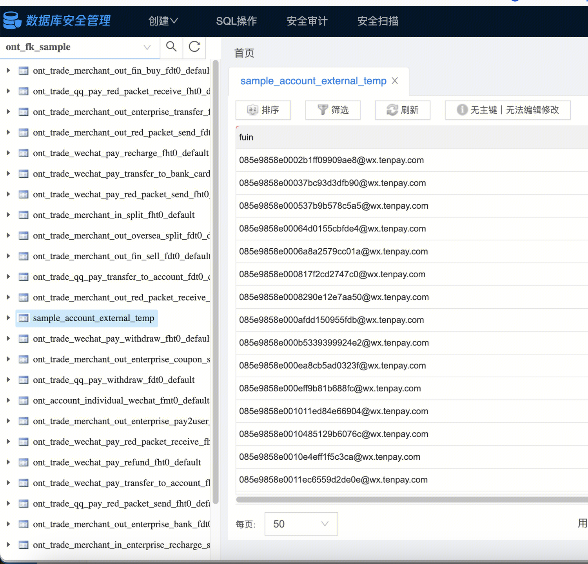
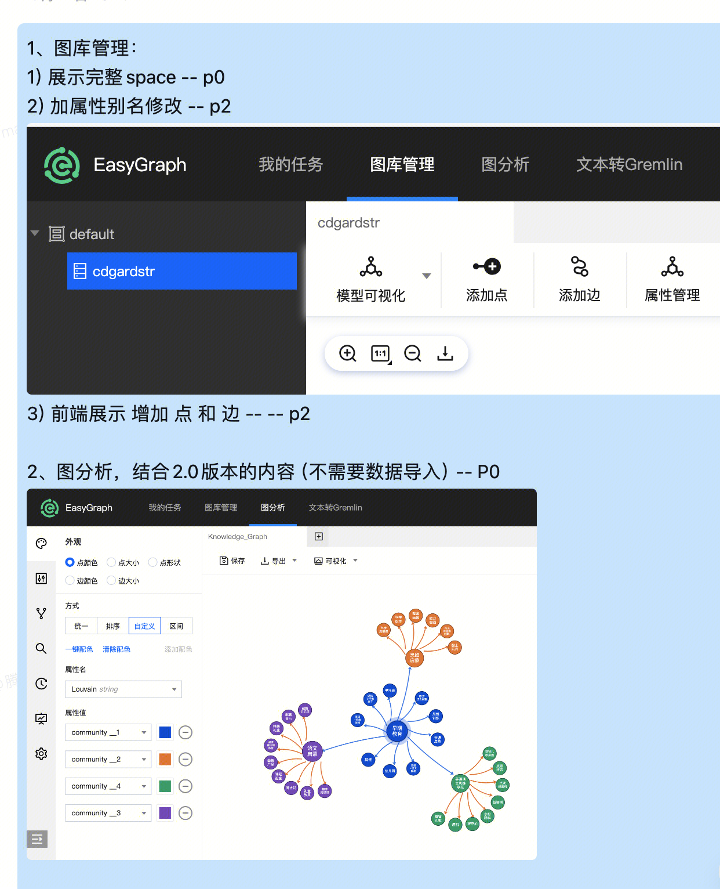
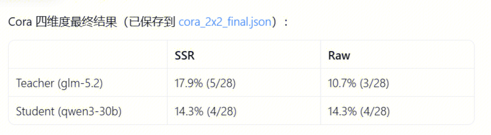

# 一、数据构建进展@marciachma(marciachma)

完整scheme：[http://21.91.126.55:4175/](http://21.91.126.55:4175/ "http://21.91.126.55:4175/")

进行中：

1）数据问题传导：最新问题传导给kgwu进行变更，核心问题：

i.数据表空值：部分处理，离线任务未导入。

ii.部分关联字段为空：处理中，后期导入该部分数据；

iii.加解密逻辑不同，无法关联：未处理。

2）反洗钱scheme融合构建：[http://21.214.192.54:8080/index_revised.html#trade_wechat_pay_recharge](http://21.214.192.54:8080/index_revised.html#trade_wechat_pay_recharge "http://21.214.192.54:8080/index_revised.html#trade_wechat_pay_recharge")

i. 实体构建还未实现，当前【主体】和【账户】基本都和风控数据一致。

ii. 风险点：反洗钱数据数平决策不出专区，边数据可能需要单独构建导出，可能无法与风控本体数据进行对比。

3）采样数据构建与导入：基于yuchun组的样本数据，采样一版图关联数据导入至测试集群，预计下周五前实现一版。

4）前端开发展示：**Teg侧**预计**下周一实现scheme增删改能力**，实现后代码上传至代码仓。

进一步准备接入fit鉴权，部署至中心内服务器，预期两周上线。

其他项目管理进展记录：

知识图谱推理建设规划

# 二、大模型探索进展 @dabinchen(dabinchen)

### 实验设计：

**先从以下方面开展复现工作**

（1）首先复现 GraphSSR 原论文内容，并选择适配的子图模型；

（2）构建异构数据集与相关任务，通过**四维度验证判断 GraphSSR 是否带来提升**，即“教师 + GraphSSR”是否表现最优，据此评估该数据集是否具备用于训练的价值；

四维度例子：

（3）针对此前提出的“选择与推理解耦、两次调用”方案，需要进行对比实验验证，可**设计仅输入选择后的小子图、与输入原始子图及小子图相结合的对照实验；**

（4）在此基础上改进 Reward 函数，并尝试 OPD 等方法进行新的探索。

（5）与图算法结合后再生成小子图。结合方式可以有多种：其一，先经图算法剪枝，将剪枝结果（可与剪枝前的原始子图一并或单独）作为输入，由大模型生成小子图；其二，由图算法生成一版候选、GraphSSR 链路生成一版候选，再一并输入大模型进行判断。此为两种可选思路。

（6）与**特征工程结合，使特征信息辅助子图生成**过程。但此路线与特征工程本身的边界可能不够清晰，区分度有限。这也正是引出下述新方向的原因：**能否让特征工程为我们提供辅助，使当前方法表现更优**？其依据在于，子图压缩本质上是一个提取重要信息的过程，而特征工程同样旨在寻找关键特征范式以表达重要信息用于判别，二者在目标上存在天然的可结合性。或者，不借助其辅助，而是在相同任务上取得优于特征工程的效果。

以上为当前不引入新知识图谱即可开展的工作。

若要与上周组会提出的“构建图谱反欺诈大模型”目标结合，则需要在子图压缩阶段引入下游任务导向的训练，并针对新知识图谱设计相关数据集。假设目前已经拥有新的知识图谱内容，则应当：

（1）设计其他类型的任务。特征工程在反欺诈场景下所针对的任务多为风险判别等判别性分类任务，若要形成差异化产出，可以从**其他方向的任务设计**入手。

**（3）的实质问题：**

关于GraphSSR到底是“子图压缩”还是“子图注意力标注”：

虽然我们之前一直把GraphSSR叫做“子图压缩”，但是GraphSSR并不是只把压缩后的子图作为输入，输入仍然是大子图，这样的话，大模型还是能看到大子图，那它是否应该叫做：重点证据标注

模型实际学到的是生成子图，然后和原来大子图一起应用解决问题的能力

可以改名成：

_任务驱动的显式证据子图选择与推理引导_  
_Task-driven Explicit Evidence Subgraph Selection and Reasoning Guidance_

`S` **不负责替代** `G0`，而是帮助模型在复杂图中先明确：

当前任务最应优先看的是什么关系、路径、实体和属性。

### 知识图谱其他方向任务设计：

关于其他方向可入手的探索任务，初步探索的几个方向如下：

例子：

风险链路：  
S 标出最关键的资金链、关键中介、时间异常点；  
G0 仍提供其他验证上下文。

风险团伙：  
S 标出共享设备/IP/卡、核心成员和连接结构；  
G0 仍保留外围成员、历史行为、其他关联。

隐性关联：  
S 标出 A-B 的主要关联路径；  
G0 仍用于确认是否存在替代解释或反证。  

大模型×知识图谱新任务范式（相对于特征工程）

[6](https://iwiki.woa.com/p/4035913956 "https://iwiki.woa.com/p/4035913956")

### 数据集设计问题：

graphssr_4dim_report.html

### GraphSSR复现情况：

复现记录

### GraphSSR原始设计的任务：

全都是判别类的问题：

**原始 GraphSSR 只设计了三类标准图学习任务，不是风险链路、团伙挖掘或知识问答：**

nc：Node Classificationlp：Link Predictionlc：Link Classification

## **1. 节点分类 NC**

输入：一个中心节点 + 它的一/两跳局部子图输出：该中心节点属于哪个类别

例如

商品节点 → 商品类别论文节点 → 学科类别用户节点 → 兴趣类别

模型先生成多个候选小子图，选择一个，再预测中心节点标签。

## **2. 链接预测 LP**

输入：两个中心节点 + 它们周围的局部图输出：二者之间是否存在某条连接

例如：

用户 A 与商品 B 是否存在交互？实体 A 与实体 B 是否有关联？

GraphSSR 的 prompt 中会要求模型输出两中心节点的连接概率/bond value，并以 `0.5` 为阈值判断是否存在链接。

## **3. 链接分类 LC**
输入：两个中心节点 + 局部图输出：它们之间的关系属于哪一类

例如：

论文 A 与论文 B 的关系类型知识图谱实体 A 与实体 B 的关系类别

即它不是判断“有没有边”，而是判断“是什么边/什么关系”。