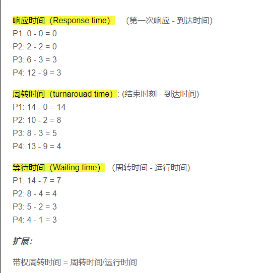

# 操作系统

Owner: xqer

成绩。40 20 20 10 10 期末 期中。实验。作业 考勤

[实验一](实验一%207be0613fdf034f5d9b4e2d6d4b513793.md)

[实验二](实验二%20a2cb376c175b411ea310f8524f7ee072.md)

[实验三](../../../xqer’s%20computer%20tree/信息内容安全/实验三%204b83fc91cf05448a95af6d8cdaddfe4e.md)

[实验四](实验四%206f4612a3037848d5addd5bd76c3aad5f.md)

[实验五](实验五%201f9723fa8a064b658d3fd7ffdf97519d.md)

[实验六](../../../xqer’s%20computer%20tree/信息内容安全/实验六%20f7dc9f81a65c4a36a972183c446d9f02.md)

[实验一](实验一%207be0613fdf034f5d9b4e2d6d4b513793.md)

[实验三](实验三%20d9287d424043405db91e23acbc474de8.md)

[实验二](实验二%20a2cb376c175b411ea310f8524f7ee072.md)

[实验五](实验五%201f9723fa8a064b658d3fd7ffdf97519d.md)

[实验六](实验六%2010e6540b37204e479c37969096839641.md)

[实验四](实验四%206f4612a3037848d5addd5bd76c3aad5f.md)

进程和线程的区别

CPU调度算法

优先级调度算法的具体实现方式

线程优先级怎么评价

进程上下文包含哪些部分

进程切换和线程切换的区别，为什么线程切换开销更小 

select poll epoll

epoll 是linux下的一种I/O事件通知机制，用于高效处理大量的I/O事件，它是linux内核提供的一种多路复用机制，可以同时监视多个文件描述符，当其中任何一个文件描述符就绪（有数据可读或可写）时，epoll就会通知应用程序进行相应的处理。

epoll的底层原理主要包括以下几个方面：

1.数据结构 ： epoll使用了三个主要的数据结构来实现高效的事件通知，分别是红黑树，就绪链表和事件表。其中红黑树用于存储所有被监视的文件描述符，就绪链表用于存储当前就绪的文件描述符，事件表用于存储每个文件描述符的事件类型和回调函数等信息。

2.注册事件：应用程序可以通过epoll_ctl系统调用向epoll中注册需要监视的文件描述符和对应的事件类型（如可读/可写） 这些注册的信息将被存储到红黑树中。 

3.等待事件： 当应用程序调用epoll_wait等待事件时，epoll内核模块会检查红黑树中的所有文件描述符，如果有文件描述符的事件已经就绪，则将其添加到就绪链表中，并通知应用程序。

4.处理事件：应用程序从就绪链表中取出就绪的文件描述符，并进行相应的I/O操作。在处理完事件后，应用程序可以再次调用epoll_wait等待下一次事件通知。

LRU的实现原理

least Recently used 最近最少使用，是一种常见的缓存淘汰策略，用于在缓存空间不足的时候决定哪些数据项应该被淘汰，以便为新的数据项腾出空间。实现原理如下：

数据结构： LRU通常使用一个哈希表和一个双向链表实现，哈希表用于快速查找缓存中是否存在某个数据项，双向链表用于记录数据项的访问顺序，最近访问的数据项在链表的头部，最久未被访问的数据项在链表的尾部。

2.访问数据项： 当一个数据项被访问时（读取或写入） 如果它已经存在于缓存中，则将其从原来的位置移动到链表的头部，表示它是最近被访问过的。如果数据项不存在于缓存中，则将其添加到链表的头部，并在哈希表中记录它的位置。

3.淘汰数据项：当缓存空间不足的时候，需要淘汰链表尾部的数据项，因为他们是最久未被访问的。通过删除链表尾部的节点，并在哈希表中删除相应的记录，来释放空间给新的数据项。

4.时间复杂度：LRU的关键操作是移动节点和删除节点，这两个操作在双向链表中的时间复杂度都是O(1)，因此整体的时间复杂度也是O(1)